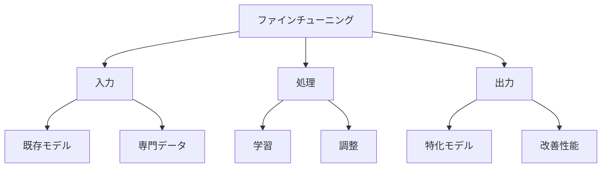

# ファインチューニング入門

ファインチューニングは、既存のAIモデルを特定の目的に合わせて調整する方法です。例えば、一般的な会話ができるAIモデルを、医療分野の専門的な会話ができるように調整することができます。

## 1. ファインチューニングって何？

### 基本的な仕組み
- 既存モデルの微調整
- 特定分野のデータで学習
- 目的に特化した性能向上

### 具体例
- 医療分野の会話
- 法律文書の理解
- プログラミング支援

### 特徴
- 少ないデータで学習可能
- 特定分野に特化
- 既存モデルの活用

## 2. 主な種類

### 完全ファインチューニング
- モデル全体を調整
- 例：医療分野の会話
- 例：法律文書の理解

### 部分ファインチューニング
- 一部の層のみ調整
- 例：特定のタスク
- 例：軽量な調整

### プロンプトチューニング
- プロンプトの最適化
- 例：会話の質向上
- 例：出力の制御

## 3. ファインチューニングの特徴

## 4. 実務での活用法

### 基本的な活用
- 分野特化
- タスク最適化
- 性能向上

### 高度な活用
- マルチタスク
- ドメイン適応
- 継続的改善

## 5. よくある質問

### Q: いつファインチューニングを使うべき？
A: 以下の場合に検討します：
- 特定分野に特化したい
- 既存モデルでは不十分
- 独自の要件がある

### Q: どれくらいのデータが必要？
A: 以下の要素で変わります：
- タスクの複雑さ
- 必要な精度
- 調整の範囲

## 6. 始め方

### 1. 基本的な考え方を学ぶ
- ファインチューニングの基本
- 使い方の基本
- 身近な例

### 2. 簡単な例で試す
- 基本的な調整
- 単純なタスク
- 基本的な応用

### 3. 少しずつ難しい問題に挑戦
- 複雑な調整
- 高度なタスク
- 実践的な活用

## 参考資料
- [Google Machine Learning Crash Course](https://developers.google.com/machine-learning/crash-course)
- [Microsoft Learn: Machine Learning](https://docs.microsoft.com/learn/paths/get-started-with-artificial-intelligence-on-azure/)
- [Kaggle Learn](https://www.kaggle.com/learn) 
