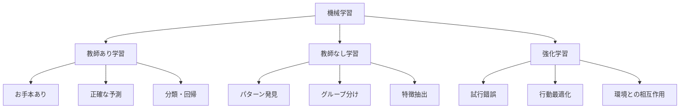

# 機械学習の3つの学び方

機械学習って聞くと難しそうに感じますが、実は私たちの日常にも似たような学び方があります。例えば、料理を学ぶとき、スポーツを学ぶとき、それぞれに合った学び方がありますよね。機械学習も同じで、目的に応じて3つの学び方があります。

## 1. 教師あり学習：お手本を見て学ぶ

### どんな学び方？
- 正解（ラベル）を見ながら学ぶ
- 例：料理のレシピを見ながら作る
- 例：スポーツのコーチの動きを真似る

### どんな時に使う？
1. 分類問題
   - スパムメールを見分ける
   - 病気の診断をする
   - 画像に写っているものを判別する

2. 回帰問題
   - 来月の売上を予測する
   - 家の価格を予測する
   - 気温を予測する

### メリット・デメリット
- メリット：正確な予測ができる
- デメリット：正解データが必要

## 2. 教師なし学習：自分でパターンを見つける

### どんな学び方？
- 正解なしでデータの特徴を見つける
- 例：音楽の好みをグループ分けする
- 例：お店の客層を分析する

### どんな時に使う？
1. クラスタリング
   - 顧客をグループ分けする
   - 文書をトピックごとに分類する
   - 異常を検知する

2. 次元削減
   - データをシンプルにまとめる
   - 重要な特徴を抽出する
   - データを可視化する

### メリット・デメリット
- メリット：正解データが不要
- デメリット：結果の解釈が難しい

## 3. 強化学習：試行錯誤で学ぶ

### どんな学び方？
- 行動の結果から学ぶ
- 例：ゲームで試行錯誤しながら攻略する
- 例：自転車に乗れるようになるまで練習する

### どんな時に使う？
1. ゲームAI
   - 囲碁や将棋のAI
   - ゲームのNPCの行動制御
   - ロボットの制御

2. 自動運転
   - 車の運転制御
   - 信号の判断
   - 障害物の回避

### メリット・デメリット
- メリット：複雑な問題も解決できる
- デメリット：学習に時間がかかる

## 3つの学び方の比較

## 実務での使い分け

### 教師あり学習が向いている場合
- 明確な正解がある
- 大量の正解データがある
- 正確な予測が必要

### 教師なし学習が向いている場合
- 正解データがない
- データの特徴を知りたい
- グループ分けが必要

### 強化学習が向いている場合
- 複雑な判断が必要
- 環境との相互作用がある
- 長期的な最適化が必要

## よくある質問

### Q: どの学び方を選べばいいの？
A: 解決したい問題の性質によって選びます。
- 正解がある → 教師あり学習
- パターンを見つけたい → 教師なし学習
- 試行錯誤が必要 → 強化学習

### Q: 複数の学び方を組み合わせることはできる？
A: はい、可能です。例えば：
- 教師なし学習で特徴を抽出
- 教師あり学習で予測
- 強化学習で最適化

## 参考資料

- [Scikit-learn: 教師あり学習](https://scikit-learn.org/stable/supervised_learning.html)
- [Scikit-learn: 教師なし学習](https://scikit-learn.org/stable/unsupervised_learning.html)
- [OpenAI Gym: 強化学習](https://gym.openai.com/) 
