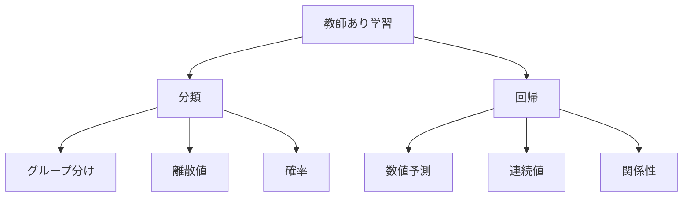

# 教師あり学習の2つの種類：分類と回帰

教師あり学習には、大きく分けて2つの種類があります。一つは「分類」で、もう一つは「回帰」です。例えば、メールを「スパムかどうか」に分けるのが分類で、「明日の気温」を予測するのが回帰です。

## 1. 分類（Classification）

### どんなことができる？
- データをグループに分ける
- 例：スパムメールを見分ける
- 例：病気の診断をする
- 例：画像に写っているものを判別する

### 主な種類
1. 2クラス分類
   - 2つのグループに分ける
   - 例：スパム/非スパム
   - 例：病気/健康

2. 多クラス分類
   - 3つ以上のグループに分ける
   - 例：猫/犬/鳥
   - 例：晴れ/曇り/雨

3. マルチラベル分類
   - 複数のラベルを付ける
   - 例：画像に「猫」と「室内」のラベル
   - 例：文章に複数のトピック

### 評価の方法
- 正解率
- 適合率
- 再現率
- F1スコア

## 2. 回帰（Regression）

### どんなことができる？
- 数値を予測する
- 例：来月の売上を予測
- 例：家の価格を予測
- 例：気温を予測

### 主な種類
1. 線形回帰
   - 直線で予測
   - 例：広告費と売上の関係
   - 例：勉強時間とテストの点数

2. 多項式回帰
   - 曲線で予測
   - 例：気温の変化
   - 例：株価の推移

3. リッジ回帰/ラッソ回帰
   - 過学習を防ぐ
   - 例：複雑な関係の予測
   - 例：ノイズの多いデータ

### 評価の方法
- 平均二乗誤差
- 決定係数
- 平均絶対誤差

## 3. 分類と回帰の比較

## 4. 実装のポイント

### データの準備
- 十分なデータを集める
- データの品質を確認
- 前処理を行う

### モデルの選択
- 問題に合ったモデルを選ぶ
- モデルの複雑さを調整
- 過学習に注意

### 評価と改善
- 適切な評価指標を選ぶ
- 結果を分析する
- 必要に応じて調整

## 5. よくある質問

### Q: 分類と回帰、どちらを選べばいい？
A: 以下の点で判断します：
- 出力がグループか数値か
- 予測したいものの性質
- 必要な精度のレベル

### Q: 両方の要素を含む問題はどうする？
A: 以下のような方法があります：
- 段階的に処理する
- 複数のモデルを組み合わせる
- ハイブリッドアプローチを取る

## 参考資料

- [Scikit-learn: 分類](https://scikit-learn.org/stable/supervised_learning.html#classification)
- [Scikit-learn: 回帰](https://scikit-learn.org/stable/supervised_learning.html#regression)
- [TensorFlow: 分類と回帰](https://www.tensorflow.org/tutorials)
