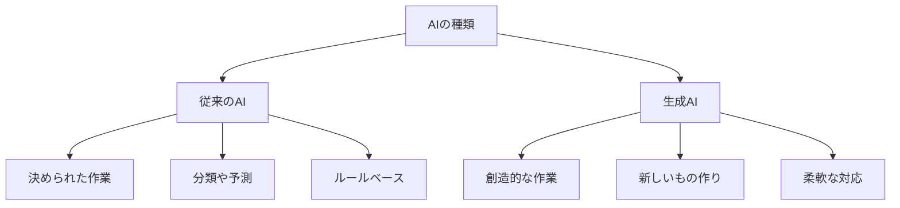
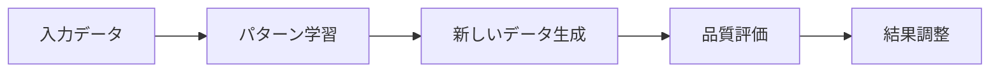

# 生成AI：新しいものを作り出すAI

生成AIは、文章を書いたり、絵を描いたり、音楽を作ったりできるAIです。まるでクリエイターのように、新しいコンテンツを作り出すことができます。

## 1. 生成AIって何？

### 基本的な仕組み
- 大量のデータから学ぶ
- パターンを見つける
- 新しいものを作る

### 従来のAIとの違い

## 2. 主な種類と使い方

### 大規模言語モデル（LLM）
- 文章の生成
- 会話の応答
- 翻訳
- 例：ChatGPT、Claude

### 画像生成AI
- イラストの作成
- 写真の編集
- デザインの生成
- 例：DALL-E、Midjourney

### 音声生成AI
- 音声の合成
- 音楽の生成
- 音声の変換
- 例：ElevenLabs、MusicLM

## 3. 生成の流れ

## 4. 実際の使い方

### ビジネスでの活用
- マーケティング文書の作成
- 商品画像の生成
- カスタマーサポート
- データ分析レポート

### クリエイティブ分野
- イラスト制作
- 音楽制作
- デザイン作成
- コンテンツ制作

### 教育・研究
- 教材の作成
- 研究データの生成
- シミュレーション
- 実験計画

## 5. メリットとデメリット

### メリット
- 創造的な作業の自動化
- 時間とコストの削減
- アイデアの創出
- 多様な表現が可能

### デメリット
- 品質のばらつき
- 著作権の問題
- 倫理的な課題
- 計算リソースの必要性

## 6. よくある質問

### Q: 生成AIは仕事を奪うの？
A: そうではありません。むしろ：
- 作業の効率化
- 新しい仕事の創出
- 人間の創造性の拡張

### Q: 生成AIの出力は信頼できる？
A: 以下の点に注意が必要です：
- 事実確認が必要
- 品質チェックが重要
- 人間の監修が不可欠

## 7. 実装のポイント

### データの準備
- 学習データの収集
- データの前処理
- 品質管理

### 生成プロセス
- パラメータの設定
- 生成条件の指定
- 結果の評価

### 品質管理
- 出力の検証
- フィードバックの収集
- 継続的な改善

## 参考資料

- [OpenAI公式ドキュメント](https://platform.openai.com/docs)
- [Stability AI](https://stability.ai/)
- [Hugging Face](https://huggingface.co/)
