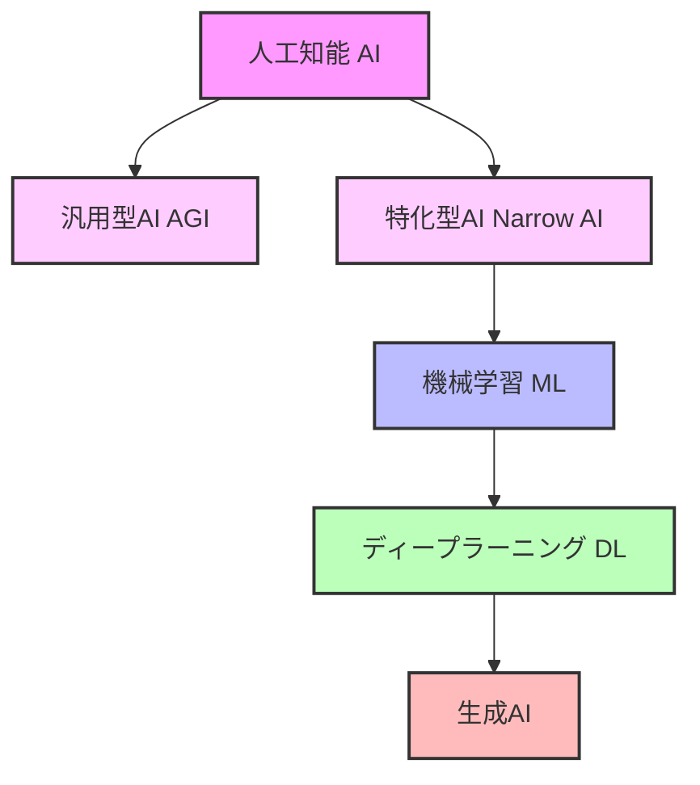
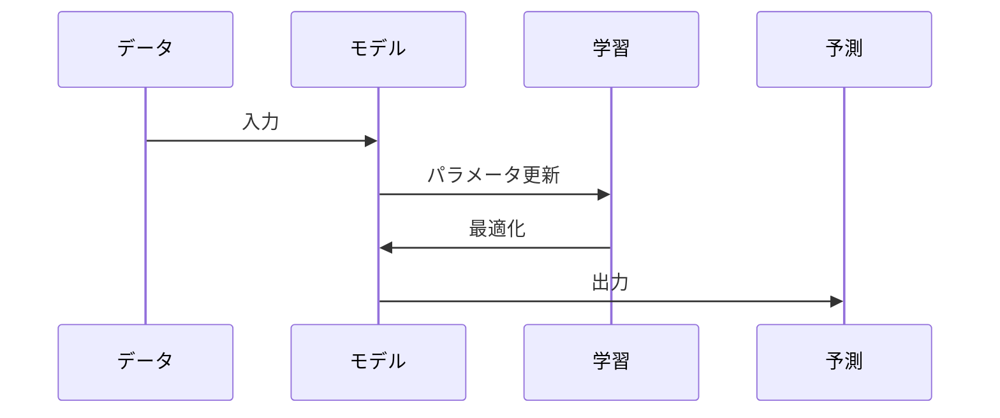

# AI、機械学習、ディープラーニングの基礎

## 概要
人工知能（AI）、機械学習（ML）、ディープラーニング（DL）、生成AIは、現代の技術革新を支える重要な分野です。これらの技術は階層的な関係にあり、より広い概念から特定の応用分野へと発展してきました。

## 主要概念の説明
- **人工知能（AI）**: 人間の知能を模倣し、学習、推論、問題解決を行うコンピュータシステムの総称
  - **汎用型AI（AGI）**: 人間のように幅広い問題に対応できる汎用的な知能を持つAI
  - **特化型AI（Narrow AI）**: 特定のタスクに特化して設計されたAI
- **機械学習（ML）**: AIの一分野で、データから学習し、パターンを認識して予測を行う技術
- **ディープラーニング（DL）**: 機械学習の手法の一つで、ニューラルネットワークを多層化し、より複雑なパターンを学習する技術
- **生成AI**: ディープラーニングを基盤とし、テキスト、画像、音声などの新しいコンテンツを生成する技術

## 技術の階層関係

## 各技術の特徴と関係
- **AI**: 最も広い概念で、ルールベースのシステムから機械学習までを含む
  - **汎用型AI**: 現時点では研究段階で、人間のような汎用的な知能の実現を目指す
  - **特化型AI**: 現在実用化されているAIのほとんどがこのカテゴリーに属する
- **ML**: AIの実現手法の一つで、データから学習する能力を持つ
- **DL**: MLの手法の一つで、特に複雑なパターン認識に優れている
- **生成AI**: DLを基盤とし、特にコンテンツ生成に特化した技術

## 実装例
- 特化型AIの例：
  - 画像認識：写真から物体を識別
  - 自然言語処理：テキストの感情分析や翻訳
  - 音声認識：音声からテキストへの変換
  - レコメンデーション：ユーザーの好みに基づく商品推薦
- 生成AIの応用：テキスト生成、画像生成、音楽生成

## 学習プロセスの視覚化

## セキュリティ考慮事項
- データのプライバシー保護
- モデルの公平性確保
- 敵対的攻撃への対策
- モデルの説明可能性の確保
- 生成AI特有の課題：著作権、誤情報生成のリスク
- 汎用型AIの実現に向けた倫理的課題

## 参考資料
- [TensorFlow公式ドキュメント](https://www.tensorflow.org/)
- [PyTorch公式ドキュメント](https://pytorch.org/)
- [scikit-learn公式ドキュメント](https://scikit-learn.org/) 
