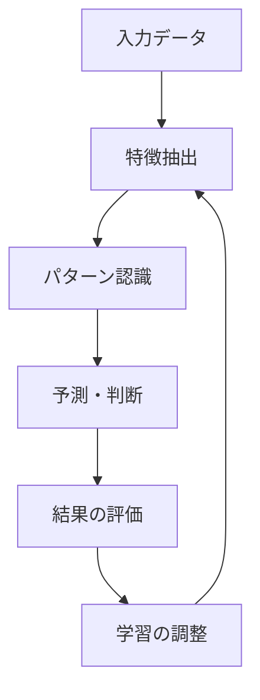

# ディープラーニング：脳の仕組みをまねた学習方法

ディープラーニングは、人間の脳の仕組みを参考にした学習方法です。私たちの脳が神経細胞（ニューロン）を使って情報を処理するように、コンピュータも似たような仕組みで学習を行います。

## 1. ディープラーニングって何？

### 基本的な仕組み
- 脳の神経細胞をまねた「ニューロン」を使う
- たくさんの層（レイヤー）を重ねて学習する
- 例：写真を見て「これは猫だ」と判断する仕組み

### 従来の機械学習との違い
- 特徴を自動で見つけられる
- より複雑な問題を解ける
- 例：従来は「耳の形」「しっぽの長さ」などを手動で教えていたが、ディープラーニングは自分で見つける

## 2. 主な種類と使い方

### 1. 畳み込みニューラルネットワーク（CNN）
- 画像認識に特化
- 例：写真から猫を判別
- 例：文字認識
- 例：顔認識

### 2. 再帰型ニューラルネットワーク（RNN）
- 時系列データの処理に特化
- 例：文章の翻訳
- 例：音声認識
- 例：株価予測

### 3. トランスフォーマー
- 文章処理に特化
- 例：チャットボット
- 例：文章要約
- 例：コード生成

## 3. 学習の流れ

## 4. 実務での活用法

### 画像認識
- 製品の品質検査
- 医療画像の診断
- 監視カメラの異常検知

### 自然言語処理
- カスタマーサポートの自動化
- 文書の分類
- 感情分析

### 音声認識
- 音声アシスタント
- 会議の文字起こし
- 音声翻訳

## 5. メリット・デメリット

### メリット
- 複雑な問題も解ける
- 特徴を自動で見つけられる
- 精度が高い

### デメリット
- 大量のデータが必要
- 計算に時間がかかる
- 結果の解釈が難しい

## 6. よくある質問

### Q: どれくらいのデータが必要？
A: 問題の複雑さによりますが、一般的に：
- 簡単な問題：数百〜数千件
- 複雑な問題：数万件以上

### Q: 学習にどれくらい時間がかかる？
A: 以下の要素で変わります：
- データの量
- モデルの複雑さ
- 使用するコンピュータの性能

## 7. 実装のポイント

### データの準備
- 十分な量のデータを集める
- データの品質を確認する
- データを適切に前処理する

### モデルの選択
- 問題に合ったモデルを選ぶ
- モデルの複雑さを調整する
- 過学習に注意する

### 学習の進め方
- 小さく始めて徐々に大きくする
- 定期的に評価する
- 問題があれば調整する

## 参考資料

- [TensorFlow公式ドキュメント](https://www.tensorflow.org/)
- [PyTorch公式ドキュメント](https://pytorch.org/)
- [Keras公式ドキュメント](https://keras.io/)
