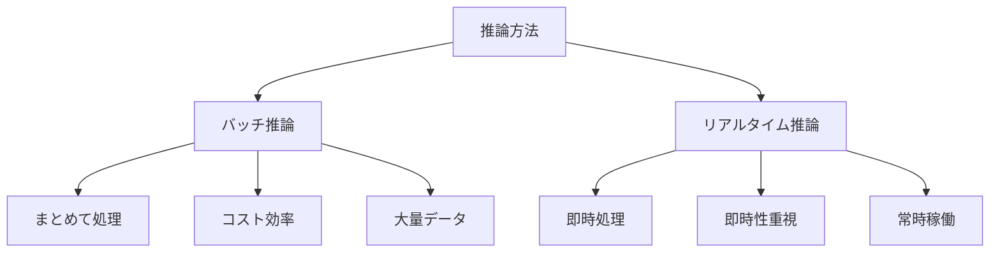

# バッチ推論とリアルタイム推論：AIの2つの実行方法

バッチ推論とリアルタイム推論は、AIモデルを実行する2つの主要な方法です。例えば、1日分の画像をまとめて分析するのがバッチ推論で、チャットボットが即座に応答するのがリアルタイム推論です。

## 1. バッチ推論って何？

### 基本的な仕組み
- データをまとめて処理する方法
- 例：1日分の画像をまとめて分析
- 例：月次のレポートを一括生成

### 従来の処理との違い
- 従来：1件ずつ処理
- バッチ：まとめて効率的に処理
- 例：1000件の画像を1回の処理で分析

## 2. リアルタイム推論って何？

### 基本的な仕組み
- データが来た瞬間に処理する方法
- 例：チャットボットの即時応答
- 例：顔認証システム

### 従来の処理との違い
- 従来：処理待ちが必要
- リアルタイム：即座に応答
- 例：ユーザーの質問にすぐに答える

## 3. 2つの方法の比較

## 4. 実務での活用法

### バッチ推論の活用
- 日次レポートの生成
- バックログデータの分析
- 定期的な予測の実行

### リアルタイム推論の活用
- チャットボット
- 異常検知システム
- リアルタイム翻訳

## 5. メリット・デメリット

### バッチ推論
- メリット
  - コスト効率が良い
  - リソースを効率的に使用
  - 大量データの処理に適している
- デメリット
  - 即時性がない
  - スケジューリングが必要
  - エラー時の再実行に時間がかかる

### リアルタイム推論
- メリット
  - 即時性が高い
  - ユーザー体験が良い
  - リアルタイムの監視が可能
- デメリット
  - コストが高い
  - リソースを常時確保
  - スケーリングが難しい

## 6. よくある質問

### Q: どちらを選べばいい？
A: 以下の点で判断します：
- 必要な応答時間
- データの量
- コストの制約

### Q: 両方の方法を組み合わせることはできる？
A: はい、可能です。例えば：
- リアルタイムで基本的な処理
- バッチで詳細な分析
- ハイブリッドな運用

## 7. 実装のポイント

### バッチ推論の実装
- スケジューリングの設定
- リソースの効率的な利用
- エラーハンドリング

### リアルタイム推論の実装
- レイテンシーの最適化
- スケーラビリティの確保
- フォールバックの準備

## 参考資料

- [TensorFlow Serving](https://www.tensorflow.org/tfx/guide/serving)
- [PyTorch Serve](https://pytorch.org/serve/)
- [AWS SageMaker](https://aws.amazon.com/sagemaker/) 
