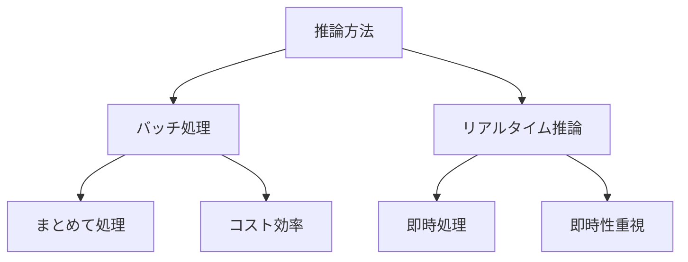

# バッチ処理とリアルタイム推論

バッチ処理とリアルタイム推論は、AIモデルを実行する2つの主要な方法です。例えば、1日分の画像をまとめて分析するのがバッチ処理で、チャットボットが即座に応答するのがリアルタイム推論です。

## 1. バッチ処理って何？

### 基本的な仕組み
- データをまとめて処理する方法
- 例：1日分の画像をまとめて分析
- 例：月次のレポートを一括生成

### 従来の処理との違い
- 従来：1件ずつ処理
- バッチ：まとめて効率的に処理
- 例：1000件の画像を1回の処理で分析

## 2. リアルタイム推論って何？

### 基本的な仕組み
- データが来た瞬間に処理する方法
- 例：チャットボットの即時応答
- 例：顔認証システム

### 従来の処理との違い
- 従来：処理待ちが必要
- リアルタイム：即座に応答
- 例：ユーザーの質問にすぐに答える

## 3. 2つの方法の比較

## 4. 実務での活用法

### バッチ処理の活用
- 日次レポートの生成
- バックログデータの分析
- 定期的な予測の実行

### リアルタイム推論の活用
- チャットボット
- 異常検知システム
- リアルタイム翻訳

## 5. よくある質問

### Q: どちらを選べばいい？
A: 以下の点で判断します：
- 必要な応答時間
- データの量
- コストの制約

### Q: 両方の方法を組み合わせることはできる？
A: はい、可能です。例えば：
- リアルタイムで基本的な処理
- バッチで詳細な分析
- ハイブリッドな運用

## 6. 始め方

### 1. 基本的な考え方を学ぶ
- バッチ処理の基本
- リアルタイム推論の基本
- 身近な例

### 2. 簡単な例で試す
- バッチ処理の実装
- リアルタイム推論の実装
- 基本的な応用

### 3. 少しずつ難しい問題に挑戦
- 複雑な処理
- 高度な応用
- 実践的な活用

## 参考資料
- [Google Machine Learning Crash Course](https://developers.google.com/machine-learning/crash-course)
- [Microsoft Learn: Machine Learning](https://docs.microsoft.com/learn/paths/get-started-with-artificial-intelligence-on-azure/)
- [Kaggle Learn](https://www.kaggle.com/learn) 
