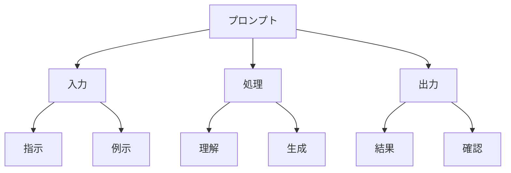

# プロンプトエンジニアリング入門

プロンプトエンジニアリングは、AIモデルに適切な指示（プロンプト）を与える技術です。例えば、「文章を要約して」という指示を「以下の文章を3行で要約してください」と具体的にすることで、より良い結果が得られます。

## 1. プロンプトエンジニアリングって何？

### 基本的な仕組み
- 適切な指示の設計
- 具体的な要件の指定
- 期待する出力の明確化

### 具体例
- 文章の要約
- コードの生成
- 質問への回答

### 特徴
- 簡単に始められる
- 即座に効果を確認
- 継続的な改善が可能

## 2. 主な種類

### 基本的なプロンプト
- 単純な指示
- 例：「要約して」
- 例：「翻訳して」

### 構造化プロンプト
- 詳細な指示
- 例：「3行で要約」
- 例：「箇条書きで説明」

### 対話型プロンプト
- 会話形式の指示
- 例：「以下のように説明して」
- 例：「このように修正して」

## 3. プロンプトの特徴

## 4. 実務での活用法

### 基本的な活用
- 文章生成
- 要約・翻訳
- 質問応答

### 高度な活用
- コード生成
- データ分析
- 意思決定支援

## 5. よくある質問

### Q: 良いプロンプトの書き方は？
A: 以下の点に注意します：
- 具体的な指示
- 明確な要件
- 適切な例示

### Q: プロンプトの改善方法は？
A: 以下の手順で行います：
- 結果の確認
- 指示の調整
- 継続的な改善

## 6. 始め方

### 1. 基本的な考え方を学ぶ
- プロンプトの基本
- 書き方の基本
- 身近な例

### 2. 簡単な例で試す
- 基本的な指示
- 単純なタスク
- 基本的な応用

### 3. 少しずつ難しい問題に挑戦
- 複雑な指示
- 高度なタスク
- 実践的な活用

## 参考資料
- [Google Machine Learning Crash Course](https://developers.google.com/machine-learning/crash-course)
- [Microsoft Learn: Machine Learning](https://docs.microsoft.com/learn/paths/get-started-with-artificial-intelligence-on-azure/)
- [Kaggle Learn](https://www.kaggle.com/learn) 
