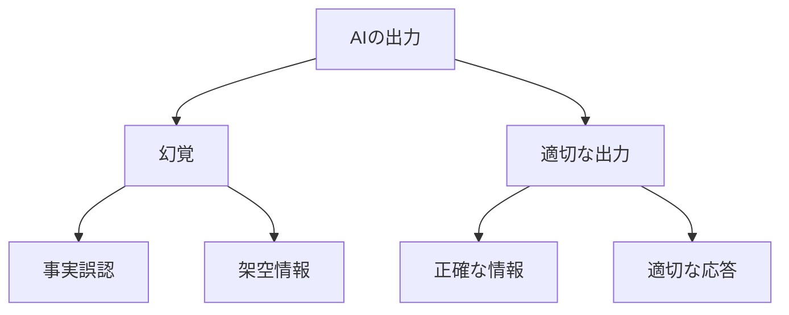

# 幻覚とプロンプト

幻覚とプロンプトは、AIの出力品質を左右する重要な要素です。例えば、AIが存在しない情報を作り出してしまうのが幻覚で、AIに適切な指示を与えるのがプロンプトです。

## 1. 幻覚って何？

### 基本的な仕組み
- AIが事実ではない情報を生成する現象
- 例：存在しない論文を引用する
- 例：架空のデータを提示する

### 発生する理由
- 学習データの不足
- 文脈の誤解
- 確信度の過大評価

## 2. プロンプトって何？

### 基本的な仕組み
- AIへの指示や質問の方法
- 例：「以下の文章を要約してください」
- 例：「この問題を3つのステップで説明してください」

### 効果的な使い方
- 具体的な指示を与える
- 文脈を明確にする
- 制約条件を設定する

## 3. 幻覚とプロンプトの関係

## 4. 実務での活用法

### 幻覚対策
- 事実確認の仕組み
- 信頼性の評価
- フィードバックループ

### プロンプトの活用
- タスクの明確化
- 出力形式の指定
- 制約条件の設定

## 5. よくある質問

### Q: 幻覚を完全に防ぐことはできる？
A: 完全な防止は難しいですが、以下の対策が有効です：
- 事実確認の仕組み
- 信頼性の評価
- フィードバックの活用

### Q: 効果的なプロンプトの書き方は？
A: 以下のポイントを意識します：
- 具体的な指示
- 明確な文脈
- 適切な制約

## 6. 始め方

### 1. 基本的な考え方を学ぶ
- 幻覚の基本
- プロンプトの基本
- 身近な例

### 2. 簡単な例で試す
- 基本的なプロンプト
- 幻覚の確認
- 改善方法

### 3. 少しずつ難しい問題に挑戦
- 複雑なプロンプト
- 高度な対策
- 実践的な活用

## 参考資料
- [Google Machine Learning Crash Course](https://developers.google.com/machine-learning/crash-course)
- [Microsoft Learn: Machine Learning](https://docs.microsoft.com/learn/paths/get-started-with-artificial-intelligence-on-azure/)
- [Kaggle Learn](https://www.kaggle.com/learn) 
