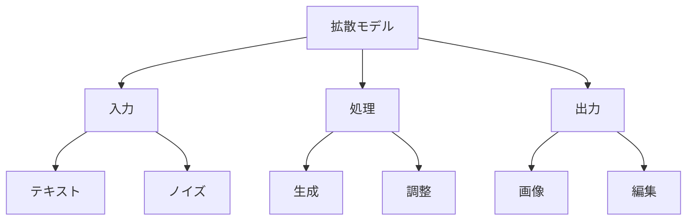

# 拡散モデル入門

拡散モデルは、ノイズから画像を生成するAI技術です。例えば、Stable DiffusionやDALL-E、Midjourneyなどが拡散モデルの代表例で、これらはテキストの説明から高品質な画像を生成することができます。

## 1. 拡散モデルって何？

### 基本的な仕組み
- ノイズから画像を徐々に生成
- 例：Stable Diffusion
- 例：DALL-E、Midjourney
- ノイズを徐々に取り除いて画像を作る

### 生成の流れ
- 入力：ノイズ（ランダムな点の集まり）
- 中間：徐々に形が現れる
- 出力：完成した画像

### 特徴
- 高品質な画像生成
- テキストからの生成
- 画像の編集や変換

## 2. 主な種類

### テキストから画像生成
- テキストの説明から画像を作る
- 例：「青い空と白い雲」
- 例：「かわいい猫の写真」

### 画像の編集
- 既存の画像を修正
- 例：背景の変更
- 例：スタイルの変更

### 画像の変換
- 画像のスタイルを変える
- 例：写真を絵画風に
- 例：スケッチを完成画に

## 3. 拡散モデルの特徴

## 4. 実務での活用法

### 基本的な活用
- 画像生成
- イラスト作成
- デザイン支援

### 高度な活用
- 画像編集
- スタイル変換
- コンテンツ生成

## 5. よくある質問

### Q: 拡散モデルはどう選べばいい？
A: 以下の点で判断します：
- 生成品質
- 処理速度
- コスト

### Q: どんな画像が作れる？
A: 以下のような画像が作れます：
- 写真風の画像
- イラスト
- アート作品

## 6. 始め方

### 1. 基本的な考え方を学ぶ
- 拡散モデルの基本
- 使い方の基本
- 身近な例

### 2. 簡単な例で試す
- 基本的な生成
- 単純な編集
- 基本的な応用

### 3. 少しずつ難しい問題に挑戦
- 複雑な生成
- 高度な編集
- 実践的な活用

## 参考資料
- [Google Machine Learning Crash Course](https://developers.google.com/machine-learning/crash-course)
- [Microsoft Learn: Machine Learning](https://docs.microsoft.com/learn/paths/get-started-with-artificial-intelligence-on-azure/)
- [Kaggle Learn](https://www.kaggle.com/learn)
