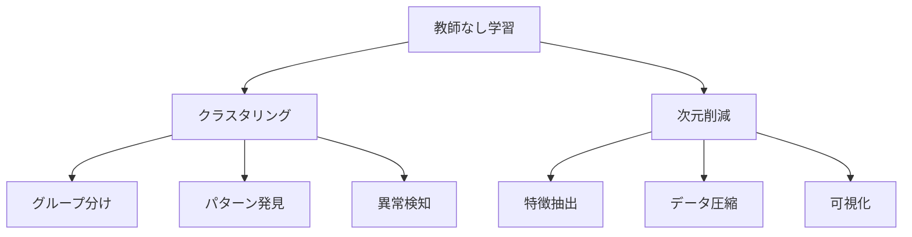

# 教師なし学習の2つの種類：クラスタリングと次元削減

教師なし学習は、正解データがなくても、データの特徴を見つけ出す方法です。例えば、お店の客層を分析したり、大量のデータを整理したりするのに使われます。

## 1. クラスタリング

### どんなことができる？
- データをグループに分ける
- 似ているものを集める
- パターンを見つける

### 主な方法
1. K-means法
   - 指定した数のグループに分ける
   - 例：顧客を3つのグループに分ける
   - 例：商品をカテゴリごとに分類

2. 階層的クラスタリング
   - グループを階層的に作る
   - 例：生物の分類
   - 例：文書のトピック分類

3. DBSCAN
   - 密度に基づいてグループを作る
   - 例：異常検知
   - 例：顧客の行動パターン分析

### 評価の方法
- シルエット係数
- エルボー法
- クラスターの密度

## 2. 次元削減

### どんなことができる？
- データをシンプルにする
- 重要な特徴を抽出する
- データを可視化する

### 主な方法
1. 主成分分析（PCA）
   - データの主要な方向を見つける
   - 例：顧客データの分析
   - 例：画像の圧縮

2. t-SNE
   - データの関係性を保ちながら可視化
   - 例：文書の類似性分析
   - 例：遺伝子発現データの分析

3. UMAP
   - 大規模データの可視化
   - 例：高次元データの分析
   - 例：時系列データの分析

### 評価の方法
- 再構成誤差
- クラスターの分離度
- 可視化の品質

## 3. クラスタリングと次元削減の比較

## 4. 実装のポイント

### データの準備
- データの前処理
- スケーリング
- 欠損値の処理

### 手法の選択
- データの性質に合わせる
- 目的に応じて選ぶ
- 計算コストを考慮

### 評価と改善
- 結果の解釈
- パラメータの調整
- 継続的な改善

## 5. よくある質問

### Q: クラスタリングと次元削減、どちらを使えばいい？
A: 目的によって選びます：
- グループ分けが目的 → クラスタリング
- データの整理が目的 → 次元削減

### Q: 両方の手法を組み合わせることはできる？
A: はい、可能です。例えば：
- 次元削減でデータを整理
- クラスタリングでグループ分け
- 結果を可視化

## 参考資料

- [Scikit-learn: クラスタリング](https://scikit-learn.org/stable/modules/clustering.html)
- [Scikit-learn: 次元削減](https://scikit-learn.org/stable/modules/decomposition.html)
- [UMAP公式ドキュメント](https://umap-learn.readthedocs.io/) 
