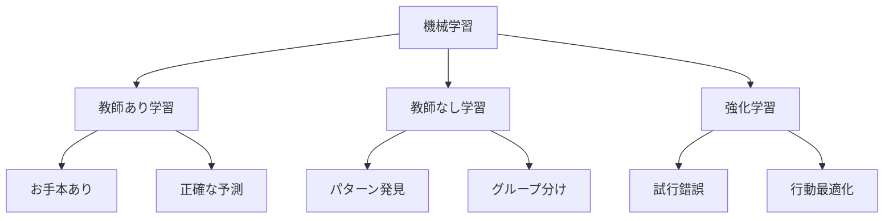

# 機械学習の学び方

機械学習は、コンピュータがデータから学ぶ方法です。例えば、料理のレシピを見ながら作るように、コンピュータもデータを見ながら学習します。

## 1. 教師あり学習：お手本を見て学ぶ

### どんな学び方？
- 正解を見ながら学ぶ
- 例：料理のレシピを見ながら作る
- 例：スポーツのコーチの動きを真似る

### 身近な例
1. スパムメールの判別
   - スパムメールと普通のメールを見分ける
   - 例：広告メールを自動で振り分ける

2. 写真の分類
   - 写真に写っているものを判別する
   - 例：猫の写真を自動で分類する

## 2. 教師なし学習：自分でパターンを見つける

### どんな学び方？
- 正解なしでデータの特徴を見つける
- 例：音楽の好みをグループ分けする
- 例：お店の客層を分析する

### 身近な例
1. 顧客のグループ分け
   - 似たような買い物をする人をグループ化
   - 例：オンラインショップでの商品推薦

2. 異常検知
   - 普通と違うパターンを見つける
   - 例：クレジットカードの不正利用検知

## 3. 強化学習：試行錯誤で学ぶ

### どんな学び方？
- 行動の結果から学ぶ
- 例：ゲームで試行錯誤しながら攻略する
- 例：自転車に乗れるようになるまで練習する

### 身近な例
1. ゲームAI
   - ゲームのキャラクターの動きを学習
   - 例：チェスや将棋のAI

2. ロボット制御
   - ロボットの動きを学習
   - 例：自動掃除機の動きの最適化

## 3つの学び方の比較

## よくある質問

### Q: どの学び方を選べばいいの？
A: 解決したい問題によって選びます：
- 正解がある → 教師あり学習
- パターンを見つけたい → 教師なし学習
- 試行錯誤が必要 → 強化学習

### Q: 機械学習を始めるには？
A: 以下の順序で学ぶと良いでしょう：
1. 基本的な考え方を理解する
2. 簡単な例で試してみる
3. 少しずつ難しい問題に挑戦する

## 参考資料
- [Google Machine Learning Crash Course](https://developers.google.com/machine-learning/crash-course)
- [Microsoft Learn: Machine Learning](https://docs.microsoft.com/learn/paths/get-started-with-artificial-intelligence-on-azure/)
- [Kaggle Learn](https://www.kaggle.com/learn) 
