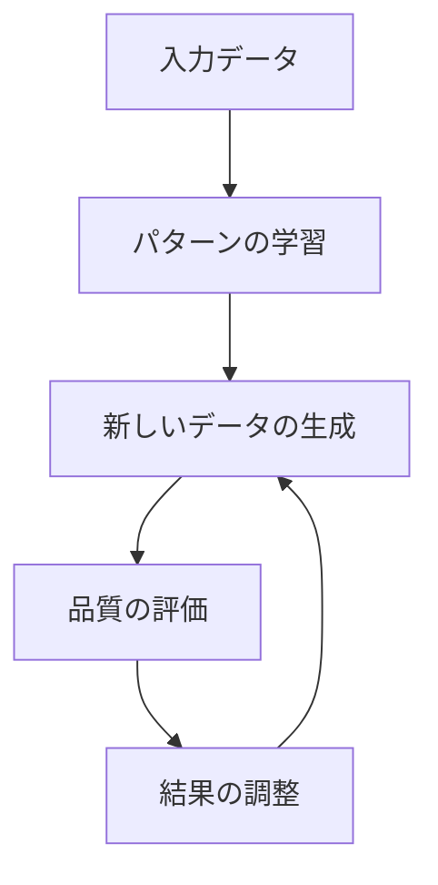

# 生成AI：新しいものを作り出すAI

生成AIは、人間のように新しいコンテンツを作り出すAIです。例えば、文章を書いたり、絵を描いたり、音楽を作ったりできます。まるでクリエイターのようなAIですね。

## 1. 生成AIって何？

### 基本的な仕組み
- 大量のデータからパターンを学ぶ
- 学んだパターンを使って新しいものを作る
- 例：たくさんの猫の写真を見て、新しい猫の絵を描く

### 従来のAIとの違い
- 従来のAI：判断や予測が主な役割
- 生成AI：新しいコンテンツを作り出す
- 例：従来のAIは「これは猫です」と判断するだけ、生成AIは「猫の絵を描く」ことができる

## 2. 主な種類と使い方

### 1. 大規模言語モデル（LLM）
- 文章を生成するAI
- 例：ChatGPT
- 例：文章の要約
- 例：コードの生成

### 2. 画像生成AI
- 絵や写真を生成するAI
- 例：DALL-E
- 例：Stable Diffusion
- 例：Midjourney

### 3. 音声生成AI
- 音声や音楽を生成するAI
- 例：音声合成
- 例：音楽生成
- 例：音声変換

## 3. 生成の流れ

## 4. 実務での活用法

### ビジネス
- マーケティング文書の作成
- 商品画像の生成
- カスタマーサポートの自動化

### クリエイティブ
- イラスト制作
- 音楽制作
- 動画編集

### 教育・研究
- 教材の作成
- 研究データの生成
- シミュレーション

## 5. メリット・デメリット

### メリット
- 創造的な作業を自動化
- 時間とコストの削減
- アイデアの創出支援

### デメリット
- 品質のばらつき
- 著作権の問題
- 誤情報の生成

## 6. よくある質問

### Q: 生成AIは人間の仕事を奪うの？
A: そうではありません。生成AIは：
- 人間の作業をサポートする道具
- 新しい可能性を広げる存在
- 人間と協働するパートナー

### Q: 生成AIの結果は信頼できる？
A: 以下の点に注意が必要です：
- 事実確認は必ず行う
- 専門家の確認を受ける
- 適切な使用方法を守る

## 7. 実装のポイント

### データの準備
- 質の高いデータを集める
- データの多様性を確保
- 適切な前処理を行う

### 生成の進め方
- 明確な指示を与える
- 結果を確認して調整
- 必要に応じて修正

### 品質管理
- 生成物のチェック
- フィードバックの収集
- 継続的な改善

## 参考資料

- [OpenAI公式サイト](https://openai.com/)
- [Stable Diffusion公式サイト](https://stability.ai/)
- [Hugging Face](https://huggingface.co/) 
