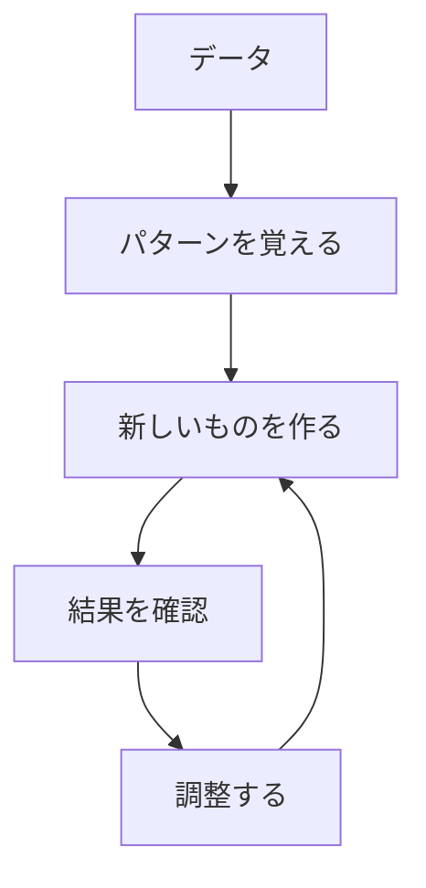

# 生成AIの基礎

生成AIは、人間のように新しいコンテンツを作り出すAIです。例えば、文章を書いたり、絵を描いたり、音楽を作ったりできます。まるでクリエイターのようなAIですね。

## 1. 生成AIって何？

### 基本的な仕組み
- 大量のデータからパターンを学ぶ
- 学んだパターンを使って新しいものを作る
- 例：たくさんの猫の写真を見て、新しい猫の絵を描く

### 従来のAIとの違い
- 従来のAI：判断や予測が主な役割
- 生成AI：新しいコンテンツを作り出す
- 例：従来のAIは「これは猫です」と判断するだけ、生成AIは「猫の絵を描く」ことができる

## 2. 主な使い方

### 1. 文章生成
- 文章を書くAI
- 例：チャットボット
- 例：文章の要約
- 例：翻訳

### 2. 画像生成
- 絵や写真を生成するAI
- 例：風景画の生成
- 例：人物画の生成
- 例：イラストの生成

### 3. 音声生成
- 音声や音楽を生成するAI
- 例：音声合成
- 例：音楽生成
- 例：音声変換

## 3. 生成の流れ

## 4. 身近な例

### スマートフォン
- 音声アシスタント
- 写真の自動編集
- 文字認識

### インターネット
- 翻訳サービス
- 検索エンジン
- 商品のおすすめ

### 家電製品
- スマートスピーカー
- 自動掃除機
- スマート冷蔵庫

## 5. よくある質問

### Q: 生成AIは人間の仕事を奪うの？
A: そうではありません。生成AIは：
- 人間の作業をサポートする道具
- 新しい可能性を広げる存在
- 人間と協働するパートナー

### Q: 生成AIの結果は信頼できる？
A: 以下の点に注意が必要です：
- 事実確認は必ず行う
- 専門家の確認を受ける
- 適切な使用方法を守る

## 6. 始め方

### 1. 基本的な考え方を学ぶ
- 生成の仕組み
- 使い方の基本
- 身近な例

### 2. 簡単な例で試す
- 文章生成
- 画像生成
- 音声生成

### 3. 少しずつ難しい問題に挑戦
- 複雑な文章生成
- 高度な画像生成
- 自然な音声生成

## 参考資料
- [Google AI Education](https://ai.google/education/)
- [Microsoft Learn: Generative AI](https://docs.microsoft.com/learn/paths/get-started-with-artificial-intelligence-on-azure/)
- [Hugging Face Tutorials](https://huggingface.co/course) 
