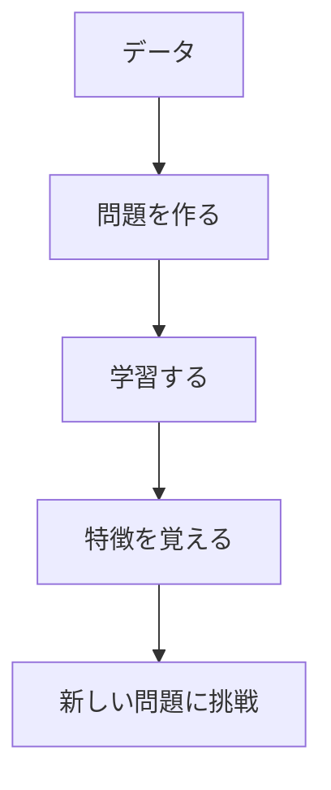

# 自己教師あり学習の基礎

自己教師あり学習は、正解データがなくても、データ自体から学習する方法です。例えば、子供が言葉を覚えるとき、辞書を見るのではなく、周りの会話から自然に学んでいくようなものです。

## 1. 自己教師あり学習って何？

### 基本的な考え方
- データから自分で問題を作る
- その問題を解きながら学習する
- 例：文章の一部を隠して、その部分を予測する

### 従来の学習方法との違い
- 教師あり学習：正解データが必要
- 教師なし学習：パターンを見つけるだけ
- 自己教師あり学習：データから問題を作って学習

## 2. 主な学習方法

### 1. 文章の予測
- 文章の一部を隠して予測
- 例：「今日は[隠す]に行きます」→「公園」を予測
- 例：チャットボットの学習

### 2. 画像の学習
- 画像の回転角度を予測
- 例：写真を回転させて、元の向きを予測
- 例：画像認識の学習

### 3. 音声の学習
- 音声の特徴を学習
- 例：音声の一部を隠して予測
- 例：音声認識の学習

## 3. 学習の流れ

## 4. 身近な例

### スマートフォン
- 音声アシスタント
- 写真の自動分類
- 文字認識

### インターネット
- 翻訳サービス
- 検索エンジン
- 商品のおすすめ

### 家電製品
- スマートスピーカー
- 自動掃除機
- スマート冷蔵庫

## 5. よくある質問

### Q: 自己教師あり学習は難しい？
A: 基本的な考え方から始めれば、誰でも理解できます：
- まずは身近な例から学ぶ
- 少しずつ知識を増やす
- 実際に使ってみる

### Q: どれくらいのデータが必要？
A: 問題の複雑さによりますが：
- 簡単な問題：数百件のデータ
- 複雑な問題：数千件以上のデータ

## 6. 始め方

### 1. 基本的な考え方を学ぶ
- 問題の作り方
- 学習の流れ
- 身近な例

### 2. 簡単な例で試す
- 文章の予測
- 画像の学習
- 音声の学習

### 3. 少しずつ難しい問題に挑戦
- 複雑な文章の予測
- 高度な画像認識
- 自然な音声認識

## 参考資料
- [Google AI Education](https://ai.google/education/)
- [Microsoft Learn: Self-Supervised Learning](https://docs.microsoft.com/learn/paths/get-started-with-artificial-intelligence-on-azure/)
- [Hugging Face Tutorials](https://huggingface.co/course) 
