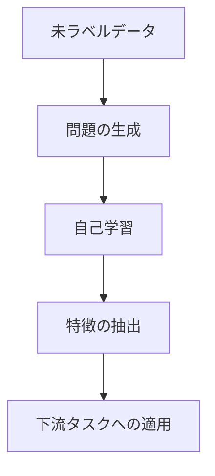

# 自己教師あり学習：データから自分で学ぶ方法

自己教師あり学習は、正解データがなくても、データ自体から学習する方法です。例えば、子供が言葉を覚えるとき、辞書を見るのではなく、周りの会話から自然に学んでいくようなものです。

## 1. 自己教師あり学習って何？

### 基本的な考え方
- データから自分で問題を作る
- その問題を解きながら学習する
- 例：文章の一部を隠して、その部分を予測する

### 従来の学習方法との違い
- 教師あり学習：正解データが必要
- 教師なし学習：パターンを見つけるだけ
- 自己教師あり学習：データから問題を作って学習

## 2. 主な学習方法

### 1. マスク言語モデル（MLM）
- 文章の一部を隠して予測
- 例：BERTの学習方法
- 例：「今日は[隠す]に行きます」→「公園」を予測

### 2. コントラスティブ学習
- 似ているものと似ていないものを区別
- 例：画像の回転角度を予測
- 例：同じ画像の異なる見え方を学習

### 3. 自己回帰学習
- 前の部分から次の部分を予測
- 例：GPTの学習方法
- 例：「今日は」→「晴れ」を予測

## 3. 学習の流れ

## 4. 実務での活用法

### 自然言語処理
- 文章の理解
- 翻訳
- 要約

### 画像認識
- 物体認識
- 画像分類
- 異常検知

### 音声処理
- 音声認識
- 話者認識
- 感情分析

## 5. メリット・デメリット

### メリット
- 正解データが不要
- 大量のデータを活用できる
- 汎用的な特徴を学習できる

### デメリット
- 学習に時間がかかる
- 計算リソースが必要
- タスク設計が難しい

## 6. よくある質問

### Q: どれくらいのデータが必要？
A: 一般的に：
- 基本的な学習：数万件
- 高度な学習：数十万件以上

### Q: どんな問題に使える？
A: 以下のような場合に有効：
- 正解データが少ない
- 大量の未ラベルデータがある
- 汎用的な特徴が必要

## 7. 実装のポイント

### データの準備
- 十分な量のデータを集める
- データの品質を確認する
- 前処理を適切に行う

### 学習の進め方
- 適切な問題を設計する
- 学習の進み具合を確認する
- 必要に応じて調整する

### 評価の方法
- 下流タスクでの性能を確認
- 学習した特徴の質を評価
- 計算効率を確認

## 参考資料

- [BERT論文](https://arxiv.org/abs/1810.04805)
- [GPT論文](https://cdn.openai.com/research-covers/language-unsupervised/language_understanding_paper.pdf)
- [SimCLR論文](https://arxiv.org/abs/2002.05709) 
