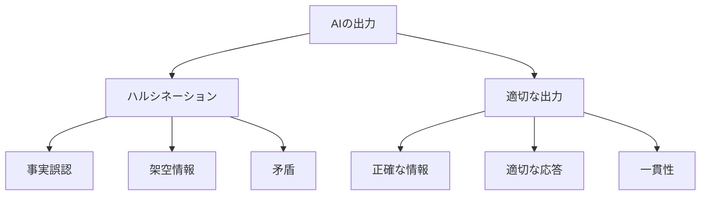

# ハルシネーションとプロンプト：AIの出力を制御する方法

ハルシネーションとプロンプトは、AIの出力品質を左右する重要な要素です。例えば、AIが存在しない情報を作り出してしまうのがハルシネーションで、AIに適切な指示を与えるのがプロンプトです。

## 1. ハルシネーションって何？

### 基本的な仕組み
- AIが事実ではない情報を生成する現象
- 例：存在しない論文を引用する
- 例：架空のデータを提示する

### 発生する理由
- 学習データの不足
- 文脈の誤解
- 確信度の過大評価

## 2. プロンプトって何？

### 基本的な仕組み
- AIへの指示や質問の方法
- 例：「以下の文章を要約してください」
- 例：「この問題を3つのステップで説明してください」

### 効果的な使い方
- 具体的な指示を与える
- 文脈を明確にする
- 制約条件を設定する

## 3. ハルシネーションとプロンプトの関係

## 4. 実務での活用法

### ハルシネーション対策
- 事実確認の仕組み
- 信頼性の評価
- フィードバックループ

### プロンプトの活用
- タスクの明確化
- 出力形式の指定
- 制約条件の設定

## 5. メリット・デメリット

### ハルシネーション
- メリット
  - 創造的な出力が可能
  - 新しい視点の提供
  - 問題解決の柔軟性
- デメリット
  - 信頼性の低下
  - 誤情報の拡散
  - 判断の誤り

### プロンプト
- メリット
  - 出力の制御が可能
  - 品質の向上
  - 一貫性の確保
- デメリット
  - 設計の複雑さ
  - 学習コスト
  - 柔軟性の制限

## 6. よくある質問

### Q: ハルシネーションを完全に防ぐことはできる？
A: 完全な防止は難しいですが、以下の対策が有効です：
- 事実確認の仕組み
- 信頼性の評価
- フィードバックの活用

### Q: 効果的なプロンプトの書き方は？
A: 以下のポイントを意識します：
- 具体的な指示
- 明確な文脈
- 適切な制約

## 7. 実装のポイント

### ハルシネーション対策
- 検証システムの構築
- 信頼性スコアの導入
- フィードバックの収集

### プロンプト設計
- タスクの分析
- 指示の明確化
- テストと改善

## 参考資料

- [OpenAI Prompt Engineering Guide](https://platform.openai.com/docs/guides/prompt-engineering)
- [Anthropic Claude Documentation](https://docs.anthropic.com/claude/docs)
- [Google AI Safety](https://ai.google/responsibility/safety/) 
