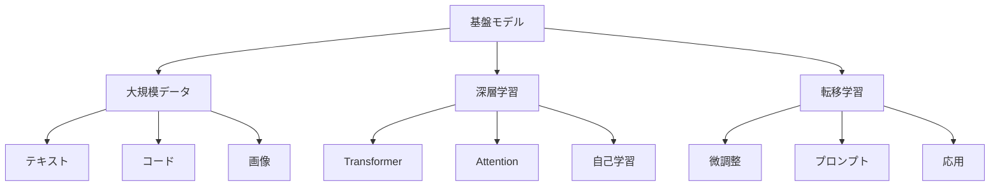

# 基盤モデル：AIの基礎となる大規模言語モデル

基盤モデルは、様々なタスクに対応できる大規模なAIモデルです。例えば、GPTやBERT、Claudeなどが基盤モデルの代表例で、これらは文章の理解から生成まで、幅広い能力を持っています。

## 1. 基盤モデルって何？

### 基本的な仕組み
- 大量のデータで学習した大規模モデル
- 例：GPT-4、Claude、BERT
- 例：PaLM、LLaMA、Mistral

### 特徴
- 汎用的な能力
- 転移学習が可能
- 多様なタスクに対応

## 2. 主な種類

### 言語モデル
- 文章の理解と生成
- 例：GPTシリーズ
- 例：Claude

### マルチモーダルモデル
- テキストと画像の処理
- 例：GPT-4V
- 例：Claude 3

### コード生成モデル
- プログラミング言語の理解
- 例：CodeLlama
- 例：Codex

## 3. 基盤モデルの特徴

## 4. 実務での活用法

### 基本的な活用
- テキスト生成
- 文章要約
- 質問応答

### 高度な活用
- コード生成
- 画像理解
- マルチモーダル処理

## 5. メリット・デメリット

### メリット
- 汎用的な能力
- 転移学習が容易
- 開発コストの削減

### デメリット
- 計算リソースが必要
- プライバシーの懸念
- 倫理的な課題

## 6. よくある質問

### Q: 基盤モデルはどう選べばいい？
A: 以下の点で判断します：
- タスクの種類
- リソースの制約
- コストの考慮

### Q: 独自のモデルを作るべき？
A: 以下の場合に検討します：
- 特殊な要件がある
- データの制約がある
- コスト効率を重視

## 7. 実装のポイント

### モデルの選択
- タスクの分析
- リソースの確認
- コストの計算

### 活用方法
- プロンプト設計
- 微調整の検討
- 評価と改善

## 参考資料

- [Stanford Foundation Models](https://crfm.stanford.edu/)
- [Hugging Face Models](https://huggingface.co/models)
- [OpenAI Models](https://platform.openai.com/docs/models) 
