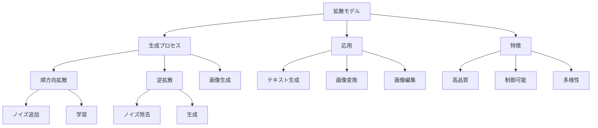

# 拡散モデル：画像生成AIの仕組み

拡散モデルは、ノイズから画像を生成するAI技術です。例えば、Stable DiffusionやDALL-E、Midjourneyなどが拡散モデルの代表例で、これらはテキストの説明から高品質な画像を生成することができます。

## 1. 拡散モデルって何？

### 基本的な仕組み
- ノイズから画像を徐々に生成
- 例：Stable Diffusion
- 例：DALL-E、Midjourney
- ノイズを徐々に取り除いて画像を作る

### 拡散プロセスの仕組み
#### 順方向拡散プロセス
- 元の画像に徐々にノイズを加える
- 最終的に完全なノイズになる
- 学習時に使用されるプロセス

#### 逆拡散プロセス
- ノイズから徐々に画像を復元
- 生成時に使用されるプロセス
- 学習した知識を使ってノイズを除去

### 生成プロセスの例
- 入力：ノイズ（ランダムな点の集まり）
- 中間：徐々に形が現れる
- 出力：完成した画像

### 特徴
- 高品質な画像生成
- テキストからの生成
- 画像の編集や変換

## 2. 主な種類

### テキスト条件付き生成
- テキストから画像を生成
- 例：Stable Diffusion
- 例：DALL-E

### 画像変換
- 画像のスタイル変換
- 例：Stable Diffusion
- 例：Midjourney

### 画像編集
- 既存画像の修正
- 例：Inpainting
- 例：Outpainting

## 3. 拡散モデルの特徴

## 4. 実務での活用法

### 基本的な活用
- 画像生成
- イラスト作成
- デザイン支援

### 高度な活用
- 画像編集
- スタイル変換
- コンテンツ生成

## 5. メリット・デメリット

### メリット
- 高品質な出力
- 細かい制御が可能
- 多様な生成

### デメリット
- 計算リソースが必要
- 生成に時間がかかる
- 倫理的課題

## 6. よくある質問

### Q: 拡散モデルはどう選べばいい？
A: 以下の点で判断します：
- 生成品質
- 処理速度
- コスト

### Q: 独自のモデルを作るべき？
A: 以下の場合に検討します：
- 特殊な要件がある
- データの制約がある
- コスト効率を重視

## 7. 実装のポイント

### モデルの選択
- 用途の明確化
- リソースの確認
- コストの計算

### 活用方法
- プロンプト設計
- パラメータ調整
- 出力の検証

## 参考資料

- [Stable Diffusion](https://stability.ai/stable-diffusion)
- [DALL-E](https://openai.com/dall-e-2)
- [Hugging Face Diffusion Models](https://huggingface.co/models?pipeline_tag=text-to-image) 
