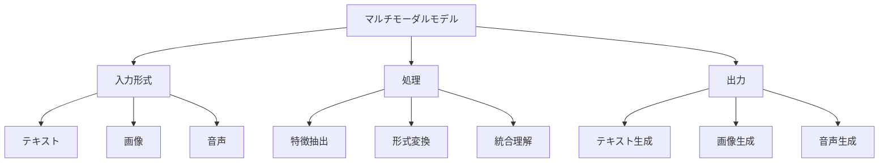

# マルチモーダルモデル：複数のデータ形式を理解するAI

マルチモーダルモデルは、テキスト、画像、音声など複数の形式のデータを同時に処理できるAIモデルです。例えば、GPT-4VやClaude 3、Geminiなどがマルチモーダルモデルの代表例で、これらは画像を見ながら説明を生成したり、音声を理解して応答したりすることができます。

## 1. マルチモーダルモデルって何？

### 基本的な仕組み
- 複数のデータ形式を同時に処理
- 例：GPT-4V、Claude 3
- 例：Gemini、Flamingo
- 異なる形式のデータを統合して理解

### 処理できるデータ形式
- テキスト
- 画像
- 音声
- 動画

### 特徴
- 複数形式の理解
- 形式間の変換
- 統合的な分析

## 2. 主な種類

### テキスト・画像モデル
- 画像の説明生成
- 例：GPT-4V
- 例：Claude 3

### テキスト・音声モデル
- 音声認識と応答
- 例：Whisper
- 例：AudioCraft

### 統合型モデル
- 複数形式の同時処理
- 例：Gemini
- 例：Flamingo

## 3. マルチモーダルモデルの特徴

## 4. 実務での活用法

### 基本的な活用
- 画像の説明生成
- 音声認識と応答
- マルチメディア分析

### 高度な活用
- コンテンツ生成
- 異常検知
- 意思決定支援

## 5. メリット・デメリット

### メリット
- 複数形式の理解
- 豊かな表現力
- 統合的な分析

### デメリット
- 計算リソースが必要
- 学習が複雑
- 精度の課題

## 6. よくある質問

### Q: マルチモーダルモデルはどう選べばいい？
A: 以下の点で判断します：
- 必要なデータ形式
- 処理能力
- コスト

### Q: 独自のモデルを作るべき？
A: 以下の場合に検討します：
- 特殊な要件がある
- データの制約がある
- コスト効率を重視

## 7. 実装のポイント

### モデルの選択
- 用途の明確化
- リソースの確認
- コストの計算

### 活用方法
- データ形式の選定
- 処理フローの設計
- 出力の検証

## 参考資料

- [OpenAI GPT-4V](https://openai.com/research/gpt-4v)
- [Anthropic Claude 3](https://www.anthropic.com/claude-3)
- [Google Gemini](https://deepmind.google/technologies/gemini/) 
