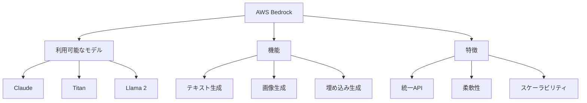

# AWS Bedrock：基盤モデルを簡単に利用するためのサービス

AWS Bedrockは、様々な基盤モデルを単一のAPIで利用できるAWSのサービスです。例えば、Claude、Titan、Llama 2など、異なるベンダーのモデルを同じインターフェースで利用でき、モデルの切り替えも簡単に行えます。

## 1. AWS Bedrockって何？

### 基本的な仕組み
- 単一のAPIで複数モデルを利用
- 例：Claude、Titan、Llama 2
- 例：Stable Diffusion、Cohere
- モデルの切り替えが容易

### 利用可能なモデル
- Anthropic Claude
- Amazon Titan
- Meta Llama 2
- Stability AI
- Cohere

### 特徴
- 統一されたAPI
- 柔軟なモデル選択
- スケーラビリティ

## 2. 主な機能

### モデル呼び出し
- テキスト生成
- 画像生成
- 埋め込み生成

### モデル管理
- モデルの選択
- パラメータの設定
- 使用量の監視

### セキュリティ
- IAMによるアクセス制御
- データの暗号化
- コンプライアンス対応

## 3. AWS Bedrockの特徴

## 4. 実務での活用法

### 基本的な活用
- テキスト生成
- 画像生成
- 埋め込み生成

### 高度な活用
- マルチモデル連携
- カスタムモデル
- エンタープライズ利用

## 5. メリット・デメリット

### メリット
- モデル切り替えが容易
- インフラ管理が不要
- スケーラビリティ

### デメリット
- コストが発生
- モデル依存
- カスタマイズの制限

## 6. よくある質問

### Q: どのモデルを選べばいい？
A: 以下の点で判断します：
- タスクの種類
- コスト
- 性能要件

### Q: 独自のモデルは使える？
A: 以下の場合に検討します：
- カスタムモデルの利用
- ファインチューニング
- プライベートモデル

## 7. 実装のポイント

### モデルの選択
- 用途の明確化
- コストの計算
- 性能の確認

### 活用方法
- APIの設計
- エラーハンドリング
- モニタリング

## 参考資料

- [AWS Bedrock 公式ドキュメント](https://docs.aws.amazon.com/bedrock/)
- [利用可能なモデル一覧](https://docs.aws.amazon.com/bedrock/latest/userguide/what-is-bedrock.html)
- [料金体系](https://aws.amazon.com/bedrock/pricing/) 
