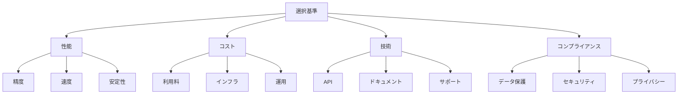

# 基盤モデルの選択基準：最適なAIモデルを見つける方法

基盤モデルを選択する際は、様々な要素を考慮する必要があります。例えば、タスクの種類、コスト、性能要件、コンプライアンスなど、複数の観点から評価することで、最適なモデルを見つけることができます。

## 1. 基盤モデルの選択って何？

### 基本的な考え方
- 用途に応じたモデル選択
- 例：テキスト生成、画像生成
- 例：コード生成、翻訳
- 複数の要素を総合的に評価

### 選択の流れ
- 要件の明確化
- モデルの調査
- 評価と比較
- 最終決定

### 特徴
- 多角的な評価
- コスト考慮
- 将来性の検討
- コンプライアンス対応

## 2. 主な評価要素

### 性能面
- 精度
- 処理速度
- 応答時間
- エラー率

### コスト面
- 利用料金
- インフラコスト
- 運用コスト
- スケーリングコスト

### 技術面
- APIの使いやすさ
- ドキュメントの充実度
- サポート体制
- カスタマイズ性

### コンプライアンス面
- データ保護規制対応
- セキュリティ認証
- プライバシー保護
- 倫理的な利用

## 3. 選択基準の特徴

## 4. 実務での活用法

### 基本的な評価
- 性能テスト
- コスト試算
- 技術検証
- コンプライアンス確認

### 高度な評価
- 長期運用シミュレーション
- スケーリング検証
- セキュリティ評価
- 規制対応の検証

## 5. メリット・デメリット

### メリット
- 最適なモデル選択
- コスト効率の向上
- リスクの低減
- 規制対応の確保

### デメリット
- 評価に時間がかかる
- 比較が複雑
- 将来の不確実性
- コンプライアンスコスト

## 6. よくある質問

### Q: どの要素を重視すべき？
A: 以下の点で判断します：
- プロジェクトの目的
- 予算の制約
- 技術的要件
- 規制要件

### Q: 評価はどう行う？
A: 以下の方法で実施します：
- プロトタイプの作成
- ベンチマークテスト
- コスト分析
- コンプライアンスチェック

## 7. 実装のポイント

### 評価方法
- テストケースの設計
- メトリクスの定義
- 比較基準の設定
- コンプライアンス要件の確認

### 選択プロセス
- 要件の優先順位付け
- 評価結果の分析
- 意思決定の記録
- 規制対応の検証

## 参考資料

- [AWS Bedrock モデル比較](https://docs.aws.amazon.com/bedrock/latest/userguide/what-is-bedrock.html)
- [OpenAI モデル性能比較](https://platform.openai.com/docs/models)
- [Anthropic Claude 性能指標](https://www.anthropic.com/claude-3)
- [GDPR コンプライアンスガイド](https://gdpr.eu/)
- [AI倫理ガイドライン](https://www.weforum.org/agenda/2021/06/ai-ethics-guidelines/) 
