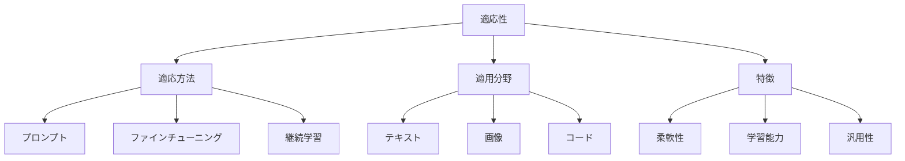

# 生成AIの適応性：様々なタスクに対応する能力

生成AIは、様々なタスクや状況に適応できる柔軟な能力を持っています。例えば、テキスト生成、画像生成、コード生成など、異なる分野のタスクに対応できるだけでなく、新しい状況にも適応して学習することができます。

## 1. 生成AIの適応性って何？

### 基本的な仕組み
- 多様なタスクへの対応
- 例：テキスト、画像、音声
- 例：コード、翻訳、要約
- 新しい状況への適応

### 適応の種類
- タスク適応
- ドメイン適応
- 言語適応
- スタイル適応

### 特徴
- 柔軟な学習
- 転移学習
- 継続的改善
- 文脈理解

## 2. 主な適応方法

### プロンプトエンジニアリング
- 指示の最適化
- 例：Few-shot learning
- 例：Chain-of-thought
- 文脈の提供

### ファインチューニング
- 特定タスクへの調整
- 例：ドメイン特化
- 例：スタイル調整
- パラメータの最適化

### 継続的学習
- 新しいデータでの学習
- 例：オンライン学習
- 例：インクリメンタル学習
- 知識の更新

## 3. 適応性の特徴

## 4. 実務での活用法

### 基本的な活用
- タスク特化
- ドメイン適応
- スタイル調整

### 高度な活用
- マルチタスク学習
- 継続的改善
- カスタマイズ

## 5. メリット・デメリット

### メリット
- 柔軟な対応
- 効率的な学習
- 継続的な改善

### デメリット
- リソースが必要
- 品質のばらつき
- 倫理的課題

## 6. よくある質問

### Q: どのように適応させる？
A: 以下の方法で実施します：
- プロンプトの最適化
- ファインチューニング
- 継続的な学習

### Q: 適応の限界は？
A: 以下の点に注意が必要です：
- データの質と量
- 計算リソース
- 倫理的制約

## 7. 実装のポイント

### 適応方法の選択
- タスクの分析
- リソースの確認
- コストの計算

### 評価と改善
- 性能評価
- 継続的な改善
- フィードバック収集

## 参考資料

- [OpenAI プロンプトエンジニアリング](https://platform.openai.com/docs/guides/prompt-engineering)
- [Hugging Face ファインチューニング](https://huggingface.co/course/chapter3)
- [Google AI 適応学習](https://ai.google/education/) 
