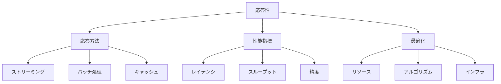

# 生成AIの応答性：素早く正確な応答を実現する仕組み

生成AIの応答性は、ユーザーの入力に対してどれだけ素早く、適切に応答できるかを示す重要な指標です。例えば、チャットボットでの会話やリアルタイム翻訳など、即時性が求められる場面で特に重要になります。

## 1. 生成AIの応答性って何？

### 基本的な仕組み
- 入力の即時処理
- 例：チャット応答
- 例：リアルタイム翻訳
- 文脈の理解と保持

### 応答の種類
- テキスト応答
- 画像生成
- 音声合成
- コード生成

### 特徴
- 低レイテンシ
- 高精度
- 文脈維持
- 一貫性

## 2. 主な応答方法

### ストリーミング応答
- 逐次的な出力
- 例：チャットストリーム
- 例：リアルタイム生成
- 部分的な表示

### バッチ処理
- 一括処理
- 例：文書生成
- 例：画像生成
- 効率的な処理

### キャッシュ活用
- 応答の高速化
- 例：頻出パターン
- 例：類似クエリ
- リソース最適化

## 3. 応答性の特徴

## 4. 実務での活用法

### 基本的な活用
- チャットボット
- リアルタイム翻訳
- コンテンツ生成

### 高度な活用
- マルチモーダル応答
- インタラクティブ生成
- リアルタイム分析

## 5. メリット・デメリット

### メリット
- 即時的な応答
- スムーズな対話
- 効率的な処理

### デメリット
- リソース消費
- 品質とのトレードオフ
- コスト増加

## 6. よくある質問

### Q: 応答速度を改善するには？
A: 以下の方法で実施します：
- リソースの最適化
- アルゴリズムの改善
- インフラの強化

### Q: 品質と速度のバランスは？
A: 以下の点に注意が必要です：
- ユースケースの要件
- リソースの制約
- コストの考慮

## 7. 実装のポイント

### パフォーマンス最適化
- リソース管理
- アルゴリズム選択
- インフラ設計

### モニタリングと改善
- 応答時間の計測
- ボトルネック分析
- 継続的な改善

## 参考資料

- [OpenAI API レスポンス最適化](https://platform.openai.com/docs/guides/performance)
- [Hugging Face 推論最適化](https://huggingface.co/docs/transformers/performance)
- [AWS 生成AI パフォーマンス](https://aws.amazon.com/bedrock/) 
