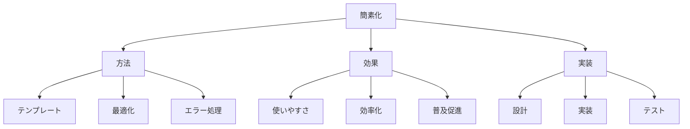

# 生成AIの簡素化：複雑な技術をシンプルに使う方法

生成AIの簡素化は、複雑な技術をより使いやすく、理解しやすくするための取り組みです。例えば、APIの抽象化やユーザーフレンドリーなインターフェースの提供など、技術的な複雑さを隠蔽することで、より多くの人が生成AIを活用できるようになります。

## 1. 生成AIの簡素化って何？

### 基本的な考え方
- 複雑さの隠蔽
- 例：APIの抽象化
- 例：UIの改善
- 使いやすさの向上

### 簡素化の種類
- インターフェース
- プロンプト
- 設定
- 運用

### 特徴
- 直感的な操作
- 最小限の設定
- 自動化
- 標準化

## 2. 主な簡素化方法

### プロンプトテンプレート
- 定型文の提供
- 例：会話テンプレート
- 例：タスクテンプレート
- 再利用可能な形式

### パラメータ最適化
- 自動設定
- 例：デフォルト値
- 例：推奨設定
- 簡易調整

### エラーハンドリング
- 自動回復
- 例：エラーメッセージ
- 例：代替案提示
- ユーザーサポート

## 3. 簡素化の特徴

## 4. 実務での活用法

### 基本的な活用
- テンプレート活用
- 自動設定
- エラー対応

### 高度な活用
- カスタマイズ
- 自動化
- 統合

## 5. メリット・デメリット

### メリット
- 導入の容易さ
- 運用の効率化
- エラー減少

### デメリット
- 柔軟性の制限
- カスタマイズの難しさ
- パフォーマンスの制約

## 6. よくある質問

### Q: どのように簡素化する？
A: 以下の方法で実施します：
- テンプレートの作成
- パラメータの最適化
- エラー処理の改善

### Q: 簡素化の限界は？
A: 以下の点に注意が必要です：
- 機能の制限
- カスタマイズ性
- パフォーマンス

## 7. 実装のポイント

### 設計方針
- ユーザー視点
- 標準化
- 拡張性

### 運用管理
- テンプレート管理
- 設定の最適化
- フィードバック収集

## 参考資料

- [OpenAI プロンプトエンジニアリング](https://platform.openai.com/docs/guides/prompt-engineering)
- [Hugging Face モデル最適化](https://huggingface.co/docs/transformers/optimization)
- [AWS Bedrock 簡素化](https://aws.amazon.com/bedrock/) 
