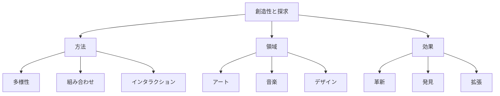

# 生成AIの創造性と探求：新しい可能性を開く力

生成AIの創造性と探求は、既存の枠組みを超えて新しいアイデアや表現を生み出す能力です。例えば、新しいアート作品の生成や、革新的な問題解決方法の発見など、人間の創造性を拡張し、新しい可能性を探求することを可能にします。

## 1. 生成AIの創造性と探求って何？

### 基本的な概念
- 新しい表現の創出
- 例：アート生成
- 例：音楽作曲
- 問題解決の革新

### 探求の種類
- 表現の探求
- 解決策の探索
- パターンの発見
- 組み合わせの創造

### 特徴
- 無限の可能性
- 予想外の発見
- 人間との協創
- 継続的な進化

## 2. 主な創造的方法

### 生成的多様性
- バリエーション創出
- 例：スタイル変換
- 例：パラメータ探索
- 新しい表現の発見

### 組み合わせ創造
- 要素の融合
- 例：クロスドメイン
- 例：ハイブリッド生成
- 革新的な表現

### インタラクティブ創造
- 人間との対話
- 例：フィードバック
- 例：共同創造
- 創造性の拡張

## 3. 創造性と探求の特徴

## 4. 実務での活用法

### 基本的な活用
- コンテンツ生成
- デザイン支援
- アイデア創出

### 高度な活用
- アート制作
- 音楽作曲
- 製品デザイン

## 5. メリット・デメリット

### メリット
- 創造性の拡張
- 効率的な探索
- 新しい発見

### デメリット
- 制御の難しさ
- 品質のばらつき
- 倫理的課題

## 6. よくある質問

### Q: 創造性を高めるには？
A: 以下の方法で実施します：
- パラメータの調整
- フィードバックの活用
- 継続的な実験

### Q: 探求の限界は？
A: 以下の点に注意が必要です：
- 技術的制約
- 倫理的境界
- 品質管理

## 7. 実装のポイント

### 創造的設計
- パラメータ設計
- フィードバック
- 評価基準

### 探求管理
- 実験計画
- 結果分析
- 継続的改善

## 参考資料

- [OpenAI クリエイティブAI](https://openai.com/research/)
- [Hugging Face 生成モデル](https://huggingface.co/models?pipeline_tag=text-generation)
- [Google AI 創造性研究](https://ai.google/research/) 
