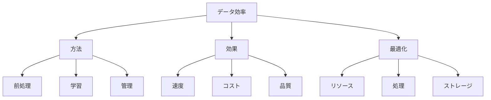

# 生成AIのデータ効率：限られたデータで最大の効果を引き出す方法

生成AIのデータ効率は、限られたデータリソースを最大限に活用し、効率的に学習や生成を行う能力です。例えば、少量のデータでの学習や、データの再利用、効率的なデータ管理など、リソースを最適化しながら高い性能を実現する方法を指します。

## 1. 生成AIのデータ効率って何？

### 基本的な概念
- データの最適活用
- 例：少量データ学習
- 例：データ再利用
- リソースの効率化

### 効率化の種類
- 学習効率
- 生成効率
- ストレージ効率
- 処理効率

### 特徴
- リソース最適化
- 高速処理
- コスト削減
- スケーラビリティ

## 2. 主な効率化方法

### データ前処理
- クレンジング
- 例：ノイズ除去
- 例：正規化
- 品質向上

### 効率的な学習
- 転移学習
- 例：事前学習
- 例：ファインチューニング
- リソース節約

### データ管理
- ストレージ最適化
- 例：圧縮
- 例：キャッシュ
- アクセス効率

## 3. データ効率の特徴

## 4. 実務での活用法

### 基本的な活用
- データ最適化
- 学習効率化
- リソース管理

### 高度な活用
- 分散処理
- 自動最適化
- スケーリング

## 5. メリット・デメリット

### メリット
- コスト削減
- 処理速度向上
- リソース最適化

### デメリット
- 実装の複雑さ
- 品質とのトレードオフ
- 管理の手間

## 6. よくある質問

### Q: 効率を高めるには？
A: 以下の方法で実施します：
- データの最適化
- 学習方法の改善
- リソースの管理

### Q: 効率化の限界は？
A: 以下の点に注意が必要です：
- 品質の維持
- リソースの制約
- コストの考慮

## 7. 実装のポイント

### 効率化設計
- データ設計
- 処理最適化
- リソース管理

### 運用管理
- モニタリング
- 最適化
- 改善

## 参考資料

- [OpenAI データ効率](https://openai.com/research/)
- [Hugging Face 最適化](https://huggingface.co/docs/transformers/optimization)
- [Google AI データ効率](https://ai.google/research/) 
