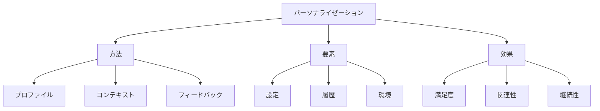

# 生成AIのパーソナライゼーション：個々のニーズに合わせた最適化

生成AIのパーソナライゼーションは、ユーザー一人一人の好みやニーズに合わせて出力を最適化する能力です。例えば、ユーザーの過去の行動履歴や設定に基づいて、より個人的で関連性の高いコンテンツを生成することができます。

## 1. 生成AIのパーソナライゼーションって何？

### 基本的な概念
- 個別最適化
- 例：ユーザー設定
- 例：行動履歴
- コンテキスト理解

### パーソナライズの種類
- コンテンツ最適化
- スタイル調整
- 言語選択
- 難易度調整

### 特徴
- 個別対応
- 継続的学習
- 文脈理解
- 適応性

## 2. 主なパーソナライズ方法

### ユーザープロファイル
- 設定管理
- 例：好みの記録
- 例：使用履歴
- 個人情報保護

### コンテキスト理解
- 状況把握
- 例：会話文脈
- 例：使用環境
- 適切な応答

### フィードバック活用
- 評価収集
- 例：明示的評価
- 例：暗黙的評価
- 継続的改善

## 3. パーソナライゼーションの特徴

## 4. 実務での活用法

### 基本的な活用
- コンテンツ最適化
- ユーザー設定
- フィードバック収集

### 高度な活用
- 行動分析
- 予測最適化
- 自動調整

## 5. メリット・デメリット

### メリット
- ユーザー満足度向上
- 関連性の向上
- 継続的な改善

### デメリット
- プライバシー懸念
- 実装の複雑さ
- リソース消費

## 6. よくある質問

### Q: パーソナライズを実現するには？
A: 以下の方法で実施します：
- ユーザープロファイルの構築
- コンテキストの理解
- フィードバックの活用

### Q: プライバシーはどう守る？
A: 以下の点に注意が必要です：
- データ保護
- 同意管理
- 透明性確保

## 7. 実装のポイント

### 設計方針
- プライバシー考慮
- ユーザー体験
- 継続的改善

### 運用管理
- データ管理
- 品質監視
- フィードバック分析

## 参考資料

- [OpenAI パーソナライゼーション](https://platform.openai.com/docs/guides/personalization)
- [Hugging Face ユーザー適応](https://huggingface.co/docs/transformers/custom_models)
- [Google AI パーソナライゼーション](https://ai.google/research/) 
