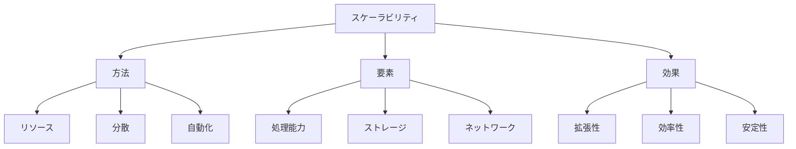

# 生成AIのスケーラビリティ：需要に応じて拡張する仕組み

生成AIのスケーラビリティは、処理量やユーザー数の増加に応じてシステムを柔軟に拡張できる能力です。例えば、トラフィックの増加に対応するための自動スケーリングや、複数のリソースを効率的に活用する分散処理など、システムの成長に合わせて適切に拡張する方法を指します。

## 1. 生成AIのスケーラビリティって何？

### 基本的な概念
- 柔軟な拡張
- 例：自動スケーリング
- 例：分散処理
- リソース最適化

### スケーリングの種類
- 水平スケーリング
- 垂直スケーリング
- 自動スケーリング
- ハイブリッドスケーリング

### 特徴
- 柔軟性
- 効率性
- コスト最適化
- 可用性

## 2. 主なスケーリング方法

### リソース管理
- 動的割り当て
- 例：コンピューティング
- 例：ストレージ
- 負荷分散

### 分散処理
- 並列実行
- 例：モデル分散
- 例：データ分散
- 効率化

### 自動化
- スケーリング制御
- 例：負荷検知
- 例：自動調整
- 最適化

## 3. スケーラビリティの特徴

## 4. 実務での活用法

### 基本的な活用
- リソース管理
- 負荷分散
- 自動スケーリング

### 高度な活用
- マルチリージョン
- ハイブリッドクラウド
- エッジコンピューティング

## 5. メリット・デメリット

### メリット
- 柔軟な拡張
- コスト最適化
- 高可用性

### デメリット
- 実装の複雑さ
- 管理の手間
- コスト増加

## 6. よくある質問

### Q: スケーリングを実現するには？
A: 以下の方法で実施します：
- リソースの最適化
- 分散処理の実装
- 自動化の導入

### Q: コストはどう管理する？
A: 以下の点に注意が必要です：
- 使用量の監視
- 最適化の実施
- 予算管理

## 7. 実装のポイント

### 設計方針
- 拡張性考慮
- コスト最適化
- 自動化

### 運用管理
- モニタリング
- 最適化
- コスト管理

## 参考資料

- [AWS スケーラビリティ](https://aws.amazon.com/scalability/)
- [Google Cloud スケーリング](https://cloud.google.com/scalability)
- [Azure スケーラビリティ](https://azure.microsoft.com/ja-jp/solutions/scalability/) 
