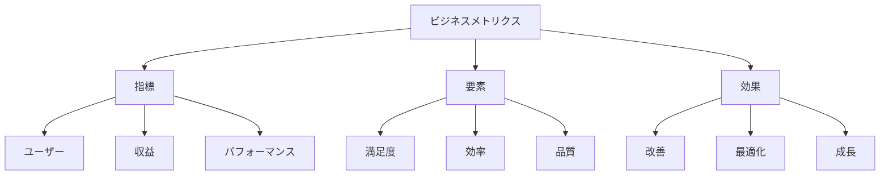

# 生成AIのビジネスメトリクス：効果を測る指標

生成AIのビジネスメトリクスは、AIシステムの効果を定量的に評価するための指標です。例えば、ユーザー満足度や収益性、パフォーマンスなど、ビジネスの成功を測るための様々な指標を指します。これらの指標を適切に設定し、継続的にモニタリングすることで、AIシステムの改善とビジネスの成長を両立させることができます。

## 1. 生成AIのビジネスメトリクスって何？

### 基本的な概念
- 効果測定
- 例：ユーザー満足度
- 例：収益性
- パフォーマンス評価

### メトリクスの種類
- ユーザー指標
- 収益指標
- パフォーマンス指標
- 効率指標

### 特徴
- 定量的評価
- 継続的改善
- 目標設定
- 効果検証

## 2. 主なメトリクス

### ユーザー満足度
- 評価収集
- 例：NPS
- 例：CSAT
- フィードバック分析

### 収益性指標
- 収益分析
- 例：ARPU
- 例：ROI
- コスト効率

### パフォーマンス指標
- 効果測定
- 例：コンバージョン
- 例：クロスドメイン
- 品質評価

## 3. メトリクスの特徴

## 4. 実務での活用法

### 基本的な活用
- 指標設定
- モニタリング
- 改善施策

### 高度な活用
- 予測分析
- 自動最適化
- 戦略立案

## 5. メリット・デメリット

### メリット
- 効果の可視化
- 改善の方向性
- 投資判断

### デメリット
- 測定の複雑さ
- コスト増加
- 誤解の可能性

## 6. よくある質問

### Q: メトリクスを設定するには？
A: 以下の方法で実施します：
- 目標の明確化
- 指標の選択
- 測定方法の確立

### Q: 効果を最大化するには？
A: 以下の点に注意が必要です：
- 継続的モニタリング
- 改善施策の実施
- フィードバック活用

## 7. 実装のポイント

### 設計方針
- 指標の選定
- 測定方法
- 改善サイクル

### 運用管理
- データ収集
- 分析
- 改善実施

## 参考資料

- [Google AI メトリクス](https://ai.google/research/)
- [AWS ビジネスメトリクス](https://aws.amazon.com/business-metrics/)
- [Microsoft AI 評価指標](https://www.microsoft.com/ja-jp/ai/metrics) 
