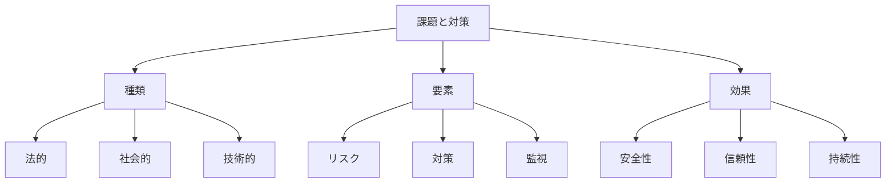

# 生成AIの課題と緩和策：リスク管理と対策

生成AIの課題と緩和策は、AIシステムの開発・運用における様々なリスクと、それらに対処する方法を指します。例えば、規制違反や社会的リスク、データセキュリティの問題など、多岐にわたる課題に対して、適切な対策を講じることで、安全で信頼性の高いAIシステムを実現することができます。

## 1. 生成AIの課題と緩和策って何？

### 基本的な概念
- リスク管理
- 例：規制対応
- 例：セキュリティ
- 対策実施

### 課題の種類
- 法的課題
- 社会的課題
- 技術的課題
- 倫理的課題

### 特徴
- 多面的対応
- 継続的改善
- 予防的対策
- 事後対応

## 2. 主な課題と対策

### 規制違反
- コンプライアンス
- 例：GDPR
- 例：AI規制
- 監査対応

### 社会的リスク
- 影響評価
- 例：バイアス
- 例：差別
- 是正措置

### セキュリティとプライバシー
- データ保護
- 例：暗号化
- 例：アクセス制御
- 監視体制

### 有害性
- コンテンツ管理
- 例：フィルタリング
- 例：検証
- 報告体制

### ハルシネーション
- 検証体制
- 例：事実確認
- 例：ソース管理
- 修正プロセス

### 解釈可能性
- 透明性確保
- 例：説明可能AI
- 例：ログ管理
- 検証方法

### 非決定性
- 制御体制
- 例：出力管理
- 例：品質保証
- 監視システム

## 3. 課題と対策の特徴

## 4. 実務での活用法

### 基本的な活用
- リスク評価
- 対策実施
- 監視体制

### 高度な活用
- 自動検出
- 予防的対策
- 継続的改善

## 5. メリット・デメリット

### メリット
- リスク低減
- 信頼性向上
- 持続的運用

### デメリット
- コスト増加
- 運用の複雑化
- 開発の遅延

## 6. よくある質問

### Q: 対策を実施するには？
A: 以下の方法で実施します：
- リスクの特定
- 対策の選定
- 実施と評価

### Q: 効果を最大化するには？
A: 以下の点に注意が必要です：
- 継続的モニタリング
- 改善の実施
- フィードバック活用

## 7. 実装のポイント

### 設計方針
- リスク考慮
- 対策の統合
- 監視体制

### 運用管理
- 定期的評価
- 改善実施
- 報告体制

## 参考資料

- [Google AI 責任あるAI](https://ai.google/responsibility/)
- [Microsoft AI 倫理](https://www.microsoft.com/ja-jp/ai/ethics)
- [OpenAI 安全性](https://openai.com/safety) 
