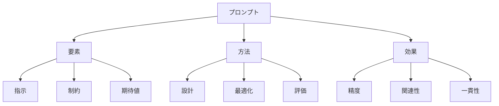

# プロンプト：AIへの指示を伝える方法

プロンプトは、AIモデルに対して意図した出力を得るために与える指示や入力のことです。例えば、「この文章を要約して」や「この画像を説明して」など、AIに何をしてほしいかを明確に伝えるための言葉や文章を指します。適切なプロンプトを設計することで、より正確で有用な結果を得ることができます。

## 1. プロンプトって何？

### 基本的な概念
- 指示伝達
- 例：文章生成
- 例：画像生成
- 出力制御

### プロンプトの種類
- テキストプロンプト
- 画像プロンプト
- マルチモーダルプロンプト
- 対話型プロンプト

### 特徴
- 明確性
- 具体性
- 一貫性
- 制御性

## 2. 主なプロンプト方法

### 基本的な設計
- 指示の明確化
- 例：目的指定
- 例：制約条件
- 出力形式

### 高度な設計
- コンテキスト設定
- 例：背景情報
- 例：前提条件
- 期待する結果

### 最適化
- 効果的な表現
- 例：キーワード
- 例：構造化
- 改善方法

## 3. プロンプトの特徴

## 4. 実務での活用法

### 基本的な活用
- 指示設計
- 出力制御
- 品質管理

### 高度な活用
- 自動生成
- 最適化
- 評価分析

## 5. メリット・デメリット

### メリット
- 出力の制御
- 精度の向上
- 効率化

### デメリット
- 設計の複雑さ
- 学習コスト
- 制約の影響

## 6. よくある質問

### Q: 効果的なプロンプトを書くには？
A: 以下の点に注意します：
- 目的の明確化
- 具体的な指示
- 制約条件の設定

### Q: プロンプトを改善するには？
A: 以下の方法で実施します：
- 結果の評価
- フィードバック活用
- 継続的な改善

## 7. 実装のポイント

### 設計方針
- 目的の明確化
- 制約の設定
- 評価方法

### 運用管理
- 品質監視
- 改善実施
- 効果測定

## 参考資料

- [OpenAI プロンプトエンジニアリング](https://platform.openai.com/docs/guides/prompt-engineering)
- [Google AI プロンプト設計](https://ai.google/research/)
- [Microsoft プロンプトベストプラクティス](https://www.microsoft.com/ja-jp/ai/prompt-engineering) 
