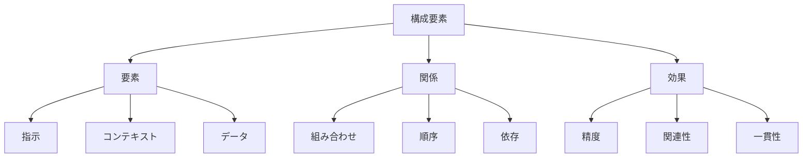

# プロンプトの構成要素：効果的な指示の組み立て方

プロンプトの構成要素は、AIモデルに対して効果的な指示を伝えるために必要な要素のことです。例えば、指示、コンテキスト、入力データ、出力インジケータなど、それぞれの要素を適切に組み合わせることで、より正確で有用な結果を得ることができます。

## 1. プロンプトの構成要素って何？

### 基本的な概念
- 要素の組み合わせ
- 例：指示の明確化
- 例：コンテキスト設定
- 出力制御

### 要素の種類
- 指示要素
- コンテキスト要素
- 入力データ要素
- 出力インジケータ要素

### 特徴
- 構造化
- 明確性
- 一貫性
- 制御性

## 2. 主な構成要素

### 指示要素
- 目的の明確化
- 例：タスク指定
- 例：制約条件
- 期待する結果

### コンテキスト要素
- 背景情報
- 例：前提条件
- 例：関連情報
- 状況説明

### 入力データ要素
- 処理対象
- 例：テキスト
- 例：画像
- データ形式

### 出力インジケータ要素
- 出力形式
- 例：フォーマット
- 例：制約
- 品質要件

## 3. 構成要素の特徴

## 4. 実務での活用法

### 基本的な活用
- 要素の選択
- 組み合わせ
- 最適化

### 高度な活用
- 自動生成
- 動的調整
- 評価分析

## 5. メリット・デメリット

### メリット
- 出力の制御
- 精度の向上
- 効率化

### デメリット
- 設計の複雑さ
- 調整の手間
- 制約の影響

## 6. よくある質問

### Q: 効果的な構成要素の組み合わせ方は？
A: 以下の点に注意します：
- 目的の明確化
- 要素の選択
- 順序の最適化

### Q: 構成要素を改善するには？
A: 以下の方法で実施します：
- 結果の評価
- フィードバック活用
- 継続的な改善

## 7. 実装のポイント

### 設計方針
- 要素の選定
- 組み合わせ方
- 評価方法

### 運用管理
- 品質監視
- 改善実施
- 効果測定

## 参考資料

- [OpenAI プロンプト構成](https://platform.openai.com/docs/guides/prompt-engineering)
- [Google AI プロンプト要素](https://ai.google/research/)
- [Microsoft プロンプト設計](https://www.microsoft.com/ja-jp/ai/prompt-engineering) 
