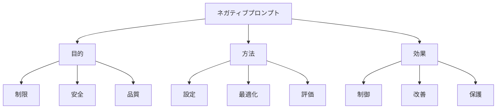

# ネガティブプロンプト：望ましくない出力を制御する方法

ネガティブプロンプトは、AIモデルに対して「これを出力しないで」という指示を与える方法です。例えば、「低品質な画像を生成しないで」や「不適切な内容を含めないで」など、望ましくない出力を制御するための指示を指します。適切なネガティブプロンプトを設定することで、より安全で質の高い結果を得ることができます。

## 1. ネガティブプロンプトって何？

### 基本的な概念
- 出力制御
- 例：品質管理
- 例：安全性確保
- 制約設定

### プロンプトの種類
- 品質制御
- 安全性制御
- 内容制御
- スタイル制御

### 特徴
- 制限性
- 予防性
- 明確性
- 効果性

## 2. 主な使用方法

### 基本的な設定
- 制限の明確化
- 例：品質基準
- 例：安全基準
- 出力制御

### 高度な設定
- 複合制御
- 例：複数条件
- 例：優先順位
- 効果最大化

### 最適化
- 効果的な表現
- 例：キーワード
- 例：構造化
- 改善方法

## 3. ネガティブプロンプトの特徴

## 4. 実務での活用法

### 基本的な活用
- 制限設定
- 品質管理
- 安全確保

### 高度な活用
- 自動制御
- 動的調整
- 評価分析

## 5. メリット・デメリット

### メリット
- 出力の制御
- 安全性向上
- 品質改善

### デメリット
- 制限の過剰
- 柔軟性低下
- 調整の複雑さ

## 6. よくある質問

### Q: 効果的なネガティブプロンプトを設定するには？
A: 以下の点に注意します：
- 制限の明確化
- 具体的な指定
- バランスの考慮

### Q: ネガティブプロンプトを改善するには？
A: 以下の方法で実施します：
- 結果の評価
- フィードバック活用
- 継続的な改善

## 7. 実装のポイント

### 設計方針
- 制限の設定
- バランス考慮
- 評価方法

### 運用管理
- 効果監視
- 改善実施
- 安全性確保

## 参考資料

- [OpenAI ネガティブプロンプト](https://platform.openai.com/docs/guides/prompt-engineering)
- [Google AI 安全制御](https://ai.google/research/)
- [Microsoft プロンプト制御](https://www.microsoft.com/ja-jp/ai/prompt-engineering) 
