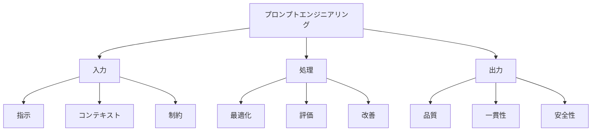

# プロンプトエンジニアリング：AIとの効果的なコミュニケーション術

プロンプトエンジニアリングは、AIモデルに対して「どう伝えれば、より良い結果が得られるか」を研究・実践する技術です。料理のレシピのように、AIに「何を」「どのように」伝えるかを工夫することで、より美味しい（質の高い）結果を引き出すことができます。

## 1. プロンプトエンジニアリングって何？

### 基本的な仕組み
- AIへの指示の最適化
- 例：文章生成、画像生成、コード生成
- 例：翻訳、要約、分析
- 期待する結果の明確化

### 主な要素
- 指示の明確さ
- コンテキストの提供
- 制約条件の設定
- 出力形式の指定

### 特徴
- 制御性
- 再現性
- 効率性
- 安全性

## 2. 主な使用方法

### 基本的な設計
- 指示の明確化
- 例：目的指定
- 例：制約条件
- 出力形式

### 高度な設計
- コンテキスト設定
- 例：背景情報
- 例：前提条件
- 期待する結果

### 最適化
- 効果的な表現
- 例：キーワード
- 例：構造化
- 改善方法

## 3. プロンプトエンジニアリングの特徴

## 4. 実務での活用法

### 基本的な活用
- 指示設計
- 出力制御
- 品質管理

### 高度な活用
- 自動生成
- 最適化
- 評価分析

## 5. メリット・デメリット

### メリット
- 出力の制御
- 精度の向上
- 効率化

### デメリット
- 設計の複雑さ
- 学習コスト
- 制約の影響

## 6. よくある質問

### Q: 効果的なプロンプトを書くには？
A: 以下の点に注意します：
- 目的の明確化
- 具体的な指示
- 制約条件の設定

### Q: プロンプトを改善するには？
A: 以下の方法で実施します：
- 結果の評価
- フィードバック活用
- 継続的な改善

## 7. 実装のポイント

### 設計方針
- 目的の明確化
- 制約の設定
- 評価方法

### 運用管理
- 品質監視
- 改善実施
- 効果測定

## 参考資料

- [OpenAI プロンプトエンジニアリング](https://platform.openai.com/docs/guides/prompt-engineering)
- [Google AI プロンプト設計](https://ai.google/research/)
- [Microsoft プロンプトベストプラクティス](https://www.microsoft.com/ja-jp/ai/prompt-engineering) 
