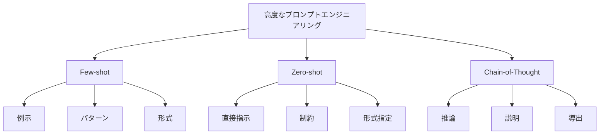

# 高度なプロンプトエンジニアリング：効果的なAI制御テクニック

高度なプロンプトエンジニアリングは、AIモデルの性能を最大限に引き出すための専門的な技術です。料理で例えるなら、材料の組み合わせ方や調理手順の工夫によって、より美味しい料理を作るようなものです。

## 1. 高度なプロンプトエンジニアリングって何？

### 基本的な概念
- 特殊な指示方法
- 例：Few-shot prompting
- 例：Zero-shot prompting
- 例：Chain-of-thought prompting

### テクニックの種類
- 例示による学習
- 直接的な指示
- 段階的な推論
- 文脈の活用

### 特徴
- 高精度
- 再現性
- 制御性
- 柔軟性

## 2. 主なテクニック

### Few-shot Prompting
- 例示による学習
- 例：入力と出力のペア
- 例：パターンの提示
- 期待する形式の具体例

### Zero-shot Prompting
- 直接的な指示
- 例：明確な指示
- 例：制約条件
- 出力形式の指定

### Chain-of-Thought Prompting
- 段階的な推論
- 例：思考過程の明示
- 例：理由の説明
- 論理的な導出

## 3. 高度なプロンプトエンジニアリングの特徴

## 4. 実務での活用法

### Few-shot Promptingの活用
- パターン学習
- 形式の統一
- 品質の安定化

### Zero-shot Promptingの活用
- 直接制御
- 柔軟な対応
- 即時適用

### Chain-of-Thought Promptingの活用
- 複雑な推論
- 説明の生成
- 論理的な導出

## 5. メリット・デメリット

### メリット
- 高精度な出力
- 制御の柔軟性
- 再現性の向上

### デメリット
- 設計の複雑さ
- リソースの消費
- 調整の手間

## 6. よくある質問

### Q: どのテクニックを選べばいい？
A: 以下の点で判断します：
- タスクの性質
- 必要な精度
- リソースの制約

### Q: テクニックを組み合わせるには？
A: 以下の方法で実施します：
- 目的の明確化
- 適切な組み合わせ
- 効果の検証

## 7. 実装のポイント

### 設計方針
- テクニックの選択
- 組み合わせ方
- 評価方法

### 運用管理
- 効果の監視
- 改善の実施
- 最適化

## 参考資料

- [OpenAI 高度なプロンプトエンジニアリング](https://platform.openai.com/docs/guides/prompt-engineering)
- [Google AI プロンプトテクニック](https://ai.google/research/)
- [Microsoft プロンプトパターン](https://www.microsoft.com/ja-jp/ai/prompt-engineering) 
