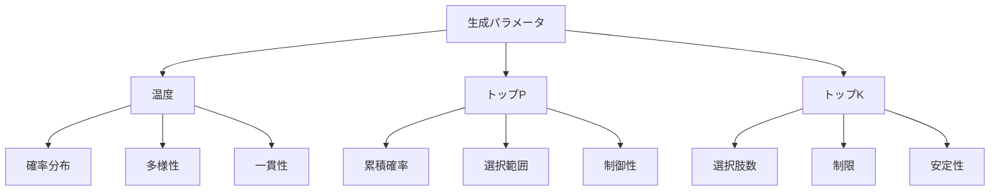

# 生成パラメータ：AIの出力を制御する調整機能

生成パラメータは、AIモデルの出力を細かく制御するための調整機能です。料理で例えるなら、火加減や調味料の量を調整することで、同じ材料でも異なる味わいを作り出せるようなものです。

## 1. 生成パラメータって何？

### 基本的な概念
- 出力の制御機能
- 例：温度（Temperature）
- 例：トップP（Top-P）
- 例：トップK（Top-K）

### パラメータの種類
- 確率分布の調整
- 選択範囲の制限
- 多様性の制御
- 一貫性の確保

### 特徴
- 制御性
- 再現性
- 柔軟性
- 安定性

## 2. 主なパラメータ

### 温度（Temperature）
- 確率分布の調整
- 例：低い値（0.2-0.5）
  - より確実な選択
  - 一貫性の高い出力
  - 保守的な生成
- 例：高い値（0.7-1.0）
  - より多様な選択
  - 創造的な出力
  - 冒険的な生成

### トップP（Top-P）
- 累積確率による制限
- 例：低い値（0.1-0.3）
  - より確実な選択
  - 一貫性の高い出力
  - 保守的な生成
- 例：高い値（0.7-0.9）
  - より多様な選択
  - 創造的な出力
  - 冒険的な生成

### トップK（Top-K）
- 選択肢の数による制限
- 例：低い値（10-20）
  - より確実な選択
  - 一貫性の高い出力
  - 保守的な生成
- 例：高い値（40-50）
  - より多様な選択
  - 創造的な出力
  - 冒険的な生成

## 3. 生成パラメータの特徴

## 4. 実務での活用法

### 温度の活用
- タスクに応じた調整
- 出力の多様性制御
- 一貫性の確保

### トップPの活用
- 確率分布の制御
- 選択範囲の最適化
- 品質の安定化

### トップKの活用
- 選択肢の制限
- 出力の制御
- 安定性の確保

## 5. メリット・デメリット

### メリット
- 出力の制御
- 品質の安定化
- 柔軟な調整

### デメリット
- 調整の複雑さ
- 効果の予測難
- 最適値の探索

## 6. よくある質問

### Q: パラメータをどう選べばいい？
A: 以下の点で判断します：
- タスクの性質
- 必要な多様性
- 品質の要件

### Q: パラメータを組み合わせるには？
A: 以下の方法で実施します：
- 目的の明確化
- 段階的な調整
- 効果の検証

## 7. 実装のポイント

### 設計方針
- パラメータの選択
- 組み合わせ方
- 評価方法

### 運用管理
- 効果の監視
- 調整の実施
- 最適化

## 参考資料

- [OpenAI 生成パラメータ](https://platform.openai.com/docs/api-reference/completions/create)
- [Google AI パラメータ設定](https://ai.google/research/)
- [Microsoft 生成制御](https://www.microsoft.com/ja-jp/ai/generation-control) 
