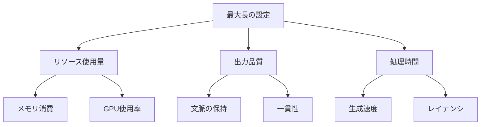

# 最大長（max_length）：AIの出力長を制御する重要なパラメータ

最大長（max_length）は、AIモデルが生成するテキストの長さを制限する重要なパラメータです。料理で例えるなら、料理の分量を決めるようなもので、適切な長さに調整することで、目的に合った出力を得ることができます。

## 1. 最大長って何？

### 基本的な概念
- 出力テキストの長さ制限
- トークン数による制御
- メモリ使用量の最適化

### 設定の重要性
- リソースの効率的な使用
- 出力の品質確保
- 処理時間の最適化

### 特徴
- 制御性
- 予測可能性
- リソース管理

## 2. 最大長の設定方法

### トークン数による指定
- 入力トークン数 + 出力トークン数の合計
- 例：GPT-3.5の場合
  - 入力：最大4096トークン
  - 出力：最大2048トークン
  - 合計：最大4096トークン

### 文字数による指定
- 言語に依存する文字数制限
- 例：日本語の場合
  - 1文字 ≈ 1-2トークン
  - 英語の場合
  - 1単語 ≈ 1-2トークン

## 3. 最大長の影響

## 4. 実務での活用法

### 適切な長さの設定
- タスクの要件に応じた調整
- リソース制約の考慮
- 品質と効率のバランス

### 長さの最適化
- 入力長の予測
- 出力長の見積もり
- バッファの確保

## 5. メリット・デメリット

### メリット
- リソースの効率的な使用
- 出力の予測可能性
- 処理時間の最適化

### デメリット
- 長い文脈の処理制限
- 出力の途中切断リスク
- 設定の複雑さ

## 6. よくある質問

### Q: 最大長はどう決めればいい？
A: 以下の要素を考慮します：
- タスクの性質
- 利用可能なリソース
- 必要な出力長

### Q: 長さが足りない場合は？
A: 以下の方法で対応します：
- 入力の要約
- 出力の分割
- 文脈の最適化

## 7. 実装のポイント

### 設計方針
- 長さの見積もり
- バッファの確保
- エラー処理

### 運用管理
- 使用量の監視
- 長さの最適化
- パフォーマンス評価

## 参考資料

- [OpenAI API ドキュメント](https://platform.openai.com/docs/api-reference/completions/create)
- [Hugging Face Transformers](https://huggingface.co/docs/transformers/main_classes/model)
- [Google AI Platform](https://cloud.google.com/ai-platform) 
