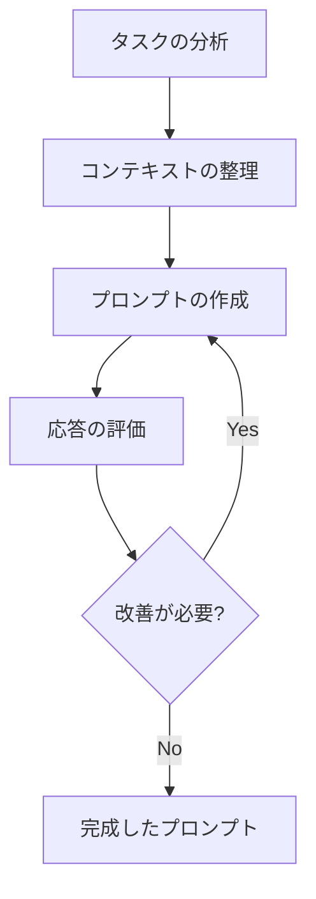

# プロンプトのベストプラクティス

プロンプトエンジニアリングは、AIモデルから最適な結果を得るための重要なスキルです。効果的なプロンプトの作成方法について解説します。

## 主要なベストプラクティス

1. **明瞭かつ簡潔な指示**
   - 具体的で明確な指示を提供する
   - 不要な情報を省き、本質的な要件に焦点を当てる
   - 曖昧な表現を避け、具体的な数値や条件を指定する

2. **コンテキストの適切な提供**
   - 必要な背景情報を含める
   - 目的や期待する出力形式を明確に示す
   - 関連する制約条件や前提条件を明示する

3. **応答タイプの明確な指定**
   - 期待する出力形式（リスト、表、コードなど）を指定
   - 出力の長さや詳細度を指定
   - 特定のフォーマットやスタイルを要求

4. **質問形式の活用**
   - タスクを質問形式で表現する
   - 段階的な質問で複雑な問題を分解
   - 対話的な形式で詳細を引き出す

5. **タスクの分割**
   - 複雑なタスクを小さなステップに分解
   - 各ステップで明確な目標を設定
   - 段階的なアプローチで全体を完成

6. **試行錯誤と改善**
   - 異なる表現やアプローチを試す
   - 結果を分析し、プロンプトを改善
   - フィードバックを基に最適化

7. **テンプレートの活用**
   - 効果的なプロンプトパターンを再利用
   - 標準的な構造を維持
   - 必要に応じてカスタマイズ

## プロンプト作成のワークフロー

## セキュリティに関する考慮事項

- 機密情報や個人情報を含めない
- プロンプトに含まれる情報の取り扱いに注意
- 出力結果の検証と確認を徹底

## 参考資料

- [OpenAI API Documentation](https://platform.openai.com/docs/guides/prompt-engineering)
- [Anthropic Claude Documentation](https://docs.anthropic.com/claude/docs) 
