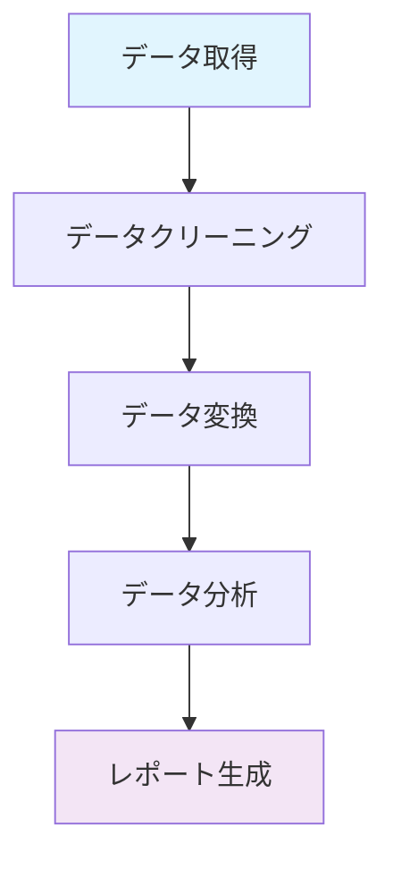

# DAG (難易度レベル: 100)

## 概要
DAG（Directed Acyclic Graph、有向非巡回グラフ）は、データサイエンス、機械学習、データエンジニアリング、ワークフロー管理など、多くの分野で使用される重要な概念です。タスク間の依存関係を表現し、効率的な処理順序を決定するために使用されます。

DAGを学ぶ意義：
- データ処理パイプラインの設計理解
- ワークフロー管理システムの基盤知識
- 依存関係の可視化と最適化
- 並列処理の効率化

## 詳細

### DAGとは

#### 基本的な概念
DAGは「Directed Acyclic Graph（有向非巡回グラフ）」の略で、以下の特徴を持つグラフ構造です：

- **有向（Directed）**: エッジ（矢印）が方向を持ち、一方向の関係を表現
- **非巡回（Acyclic）**: サイクル（循環）が存在しない
- **グラフ（Graph）**: ノード（頂点）とエッジ（辺）で構成される構造

#### DAGの特徴
```bash
# DAGの主要特徴
1. 方向性        # エッジに方向があり、依存関係を表現
2. 非巡回性      # サイクルが存在せず、無限ループを防ぐ
3. 階層構造      # タスクの実行順序が明確
4. 並列処理      # 依存関係のないタスクを並列実行可能
5. 最適化可能    # 実行順序の最適化が可能
```

### DAGの構造

#### 基本要素
```bash
# DAGの基本要素

ノード（Node）: タスクや処理を表す頂点
├── 開始ノード   # 依存関係のない最初のタスク
├── 中間ノード   # 他のタスクに依存し、他のタスクが依存するタスク
└── 終了ノード   # 他のタスクが依存しない最後のタスク

エッジ（Edge）: 依存関係を表す矢印
├── 入力エッジ   # 他のノードからの依存関係
└── 出力エッジ   # 他のノードへの依存関係
```

#### 簡単な例
```bash
# データ処理パイプラインの例

データ取得 → データクリーニング → データ変換 → データ分析 → レポート生成

# 各ステップの依存関係
データ取得: 開始ノード（依存なし）
データクリーニング: データ取得に依存
データ変換: データクリーニングに依存
データ分析: データ変換に依存
レポート生成: データ分析に依存（終了ノード）
```

### DAGの実装例

#### Pythonでの実装
```python
# 基本的なDAGクラスの実装例

class Node:
    def __init__(self, name, task=None):
        self.name = name
        self.task = task
        self.dependencies = []
        self.dependents = []
    
    def add_dependency(self, node):
        self.dependencies.append(node)
        node.dependents.append(self)
    
    def can_execute(self, completed_nodes):
        return all(dep in completed_nodes for dep in self.dependencies)

class DAG:
    def __init__(self):
        self.nodes = {}
    
    def add_node(self, name, task=None):
        if name not in self.nodes:
            self.nodes[name] = Node(name, task)
        return self.nodes[name]
    
    def add_edge(self, from_node, to_node):
        if from_node in self.nodes and to_node in self.nodes:
            self.nodes[to_node].add_dependency(self.nodes[from_node])
    
    def get_execution_order(self):
        # トポロジカルソートで実行順序を決定
        in_degree = {node: 0 for node in self.nodes}
        
        # 入次数を計算
        for node in self.nodes.values():
            for dep in node.dependencies:
                in_degree[dep.name] += 1
        
        # キューに開始ノードを追加
        queue = [node for node in self.nodes.values() if in_degree[node.name] == 0]
        result = []
        
        while queue:
            current = queue.pop(0)
            result.append(current.name)
            
            # 依存関係を更新
            for dependent in current.dependents:
                in_degree[dependent.name] -= 1
                if in_degree[dependent.name] == 0:
                    queue.append(dependent)
        
        return result

# 使用例
dag = DAG()

# ノードの追加
dag.add_node("data_fetch", lambda: print("データ取得"))
dag.add_node("data_clean", lambda: print("データクリーニング"))
dag.add_node("data_transform", lambda: print("データ変換"))
dag.add_node("data_analyze", lambda: print("データ分析"))
dag.add_node("report_generate", lambda: print("レポート生成"))

# 依存関係の設定
dag.add_edge("data_fetch", "data_clean")
dag.add_edge("data_clean", "data_transform")
dag.add_edge("data_transform", "data_analyze")
dag.add_edge("data_analyze", "report_generate")

# 実行順序の取得
execution_order = dag.get_execution_order()
print("実行順序:", execution_order)
```

#### 並列処理の例
```python
# 並列処理可能なDAGの例

class ParallelDAG:
    def __init__(self):
        self.nodes = {}
    
    def add_node(self, name, task=None):
        if name not in self.nodes:
            self.nodes[name] = Node(name, task)
        return self.nodes[name]
    
    def add_edge(self, from_node, to_node):
        if from_node in self.nodes and to_node in self.nodes:
            self.nodes[to_node].add_dependency(self.nodes[from_node])
    
    def get_parallel_groups(self):
        # 並列実行可能なグループを取得
        in_degree = {node: 0 for node in self.nodes}
        
        for node in self.nodes.values():
            for dep in node.dependencies:
                in_degree[dep.name] += 1
        
        groups = []
        remaining = set(self.nodes.values())
        
        while remaining:
            # 実行可能なノードを取得
            ready = [node for node in remaining if in_degree[node.name] == 0]
            if not ready:
                break
            
            groups.append(ready)
            remaining -= set(ready)
            
            # 依存関係を更新
            for node in ready:
                for dependent in node.dependents:
                    if dependent in remaining:
                        in_degree[dependent.name] -= 1
        
        return groups

# 並列処理の例
parallel_dag = ParallelDAG()

# ノードの追加
parallel_dag.add_node("start")
parallel_dag.add_node("task_a")
parallel_dag.add_node("task_b")
parallel_dag.add_node("task_c")
parallel_dag.add_node("merge")
parallel_dag.add_node("end")

# 依存関係の設定
parallel_dag.add_edge("start", "task_a")
parallel_dag.add_edge("start", "task_b")
parallel_dag.add_edge("start", "task_c")
parallel_dag.add_edge("task_a", "merge")
parallel_dag.add_edge("task_b", "merge")
parallel_dag.add_edge("task_c", "merge")
parallel_dag.add_edge("merge", "end")

# 並列グループの取得
parallel_groups = parallel_dag.get_parallel_groups()
for i, group in enumerate(parallel_groups):
    print(f"グループ {i+1}: {[node.name for node in group]}")
```

### 実際の使用例

#### データ処理パイプライン
```python
# データ処理パイプラインのDAG例

import pandas as pd
import numpy as np
from datetime import datetime

class DataPipelineDAG:
    def __init__(self):
        self.data = {}
    
    def fetch_data(self):
        """データ取得"""
        print("データを取得中...")
        # 実際のデータ取得処理
        self.data['raw'] = pd.DataFrame({
            'id': range(100),
            'value': np.random.randn(100),
            'category': np.random.choice(['A', 'B', 'C'], 100)
        })
        return self.data['raw']
    
    def clean_data(self, data):
        """データクリーニング"""
        print("データをクリーニング中...")
        # 欠損値の処理
        cleaned = data.dropna()
        # 重複の削除
        cleaned = cleaned.drop_duplicates()
        self.data['cleaned'] = cleaned
        return cleaned
    
    def transform_data(self, data):
        """データ変換"""
        print("データを変換中...")
        # 特徴量エンジニアリング
        transformed = data.copy()
        transformed['value_squared'] = transformed['value'] ** 2
        transformed['category_encoded'] = pd.Categorical(transformed['category']).codes
        self.data['transformed'] = transformed
        return transformed
    
    def analyze_data(self, data):
        """データ分析"""
        print("データを分析中...")
        # 基本的な統計分析
        analysis = {
            'mean': data['value'].mean(),
            'std': data['value'].std(),
            'count': len(data),
            'categories': data['category'].value_counts().to_dict()
        }
        self.data['analysis'] = analysis
        return analysis
    
    def generate_report(self, analysis):
        """レポート生成"""
        print("レポートを生成中...")
        report = f"""
        データ分析レポート
        生成日時: {datetime.now()}
        
        基本統計:
        - 平均値: {analysis['mean']:.2f}
        - 標準偏差: {analysis['std']:.2f}
        - データ数: {analysis['count']}
        
        カテゴリ別件数:
        """
        for category, count in analysis['categories'].items():
            report += f"- {category}: {count}件\n"
        
        self.data['report'] = report
        return report
    
    def execute_pipeline(self):
        """パイプラインの実行"""
        print("データ処理パイプラインを開始...")
        
        # DAGに従った実行順序
        raw_data = self.fetch_data()
        cleaned_data = self.clean_data(raw_data)
        transformed_data = self.transform_data(cleaned_data)
        analysis_result = self.analyze_data(transformed_data)
        report = self.generate_report(analysis_result)
        
        print("パイプライン完了!")
        return report

# 使用例
pipeline = DataPipelineDAG()
report = pipeline.execute_pipeline()
print(report)
```

#### 機械学習パイプライン
```python
# 機械学習パイプラインのDAG例

from sklearn.model_selection import train_test_split
from sklearn.ensemble import RandomForestClassifier
from sklearn.metrics import accuracy_score, classification_report
import joblib

class MLPipelineDAG:
    def __init__(self):
        self.data = {}
        self.model = None
    
    def load_data(self):
        """データ読み込み"""
        print("データを読み込み中...")
        # 実際のデータ読み込み処理
        from sklearn.datasets import load_iris
        iris = load_iris()
        self.data['X'] = iris.data
        self.data['y'] = iris.target
        return iris.data, iris.target
    
    def preprocess_data(self, X, y):
        """データ前処理"""
        print("データを前処理中...")
        # データの分割
        X_train, X_test, y_train, y_test = train_test_split(
            X, y, test_size=0.2, random_state=42
        )
        self.data['X_train'] = X_train
        self.data['X_test'] = X_test
        self.data['y_train'] = y_train
        self.data['y_test'] = y_test
        return X_train, X_test, y_train, y_test
    
    def train_model(self, X_train, y_train):
        """モデル訓練"""
        print("モデルを訓練中...")
        model = RandomForestClassifier(n_estimators=100, random_state=42)
        model.fit(X_train, y_train)
        self.model = model
        return model
    
    def evaluate_model(self, model, X_test, y_test):
        """モデル評価"""
        print("モデルを評価中...")
        y_pred = model.predict(X_test)
        accuracy = accuracy_score(y_test, y_pred)
        report = classification_report(y_test, y_pred)
        
        evaluation = {
            'accuracy': accuracy,
            'classification_report': report,
            'predictions': y_pred
        }
        self.data['evaluation'] = evaluation
        return evaluation
    
    def save_model(self, model):
        """モデル保存"""
        print("モデルを保存中...")
        joblib.dump(model, 'model.pkl')
        return 'model.pkl'
    
    def execute_ml_pipeline(self):
        """機械学習パイプラインの実行"""
        print("機械学習パイプラインを開始...")
        
        # DAGに従った実行順序
        X, y = self.load_data()
        X_train, X_test, y_train, y_test = self.preprocess_data(X, y)
        model = self.train_model(X_train, y_train)
        evaluation = self.evaluate_model(model, X_test, y_test)
        model_path = self.save_model(model)
        
        print(f"パイプライン完了! 精度: {evaluation['accuracy']:.3f}")
        return evaluation

# 使用例
ml_pipeline = MLPipelineDAG()
results = ml_pipeline.execute_ml_pipeline()
```

### DAGの可視化

#### グラフの描画
```python
# NetworkXを使用したDAGの可視化

import networkx as nx
import matplotlib.pyplot as plt

def visualize_dag(edges, title="DAG Visualization"):
    """DAGの可視化"""
    G = nx.DiGraph()
    G.add_edges_from(edges)
    
    # レイアウトの設定
    pos = nx.spring_layout(G)
    
    # グラフの描画
    plt.figure(figsize=(10, 8))
    nx.draw(G, pos, with_labels=True, node_color='lightblue', 
            node_size=2000, font_size=10, font_weight='bold',
            arrows=True, edge_color='gray', arrowsize=20)
    
    plt.title(title)
    plt.show()

# データ処理パイプラインの可視化
data_pipeline_edges = [
    ('データ取得', 'データクリーニング'),
    ('データクリーニング', 'データ変換'),
    ('データ変換', 'データ分析'),
    ('データ分析', 'レポート生成')
]

visualize_dag(data_pipeline_edges, "データ処理パイプライン")

# 並列処理の可視化
parallel_edges = [
    ('開始', 'タスクA'),
    ('開始', 'タスクB'),
    ('開始', 'タスクC'),
    ('タスクA', 'マージ'),
    ('タスクB', 'マージ'),
    ('タスクC', 'マージ'),
    ('マージ', '終了')
]

visualize_dag(parallel_edges, "並列処理パイプライン")
```

#### Mermaid図での表現


### DAGの最適化

#### 実行時間の最適化
```python
# DAGの実行時間最適化

class OptimizedDAG:
    def __init__(self):
        self.nodes = {}
        self.execution_times = {}
    
    def add_node(self, name, task=None, execution_time=1):
        if name not in self.nodes:
            self.nodes[name] = Node(name, task)
            self.execution_times[name] = execution_time
        return self.nodes[name]
    
    def calculate_critical_path(self):
        """クリティカルパスの計算"""
        # 各ノードの最早開始時間を計算
        earliest_start = {}
        for node_name in self.get_execution_order():
            node = self.nodes[node_name]
            if not node.dependencies:
                earliest_start[node_name] = 0
            else:
                earliest_start[node_name] = max(
                    earliest_start[dep.name] + self.execution_times[dep.name]
                    for dep in node.dependencies
                )
        
        # 各ノードの最遅開始時間を計算
        latest_start = {}
        execution_order = self.get_execution_order()
        for node_name in reversed(execution_order):
            node = self.nodes[node_name]
            if not node.dependents:
                latest_start[node_name] = earliest_start[node_name]
            else:
                latest_start[node_name] = min(
                    latest_start[dep.name] - self.execution_times[node_name]
                    for dep in node.dependents
                )
        
        # クリティカルパスを特定
        critical_path = []
        for node_name in execution_order:
            if earliest_start[node_name] == latest_start[node_name]:
                critical_path.append(node_name)
        
        return critical_path, earliest_start, latest_start

# 最適化の例
optimized_dag = OptimizedDAG()

# ノードの追加（実行時間付き）
optimized_dag.add_node("A", execution_time=2)
optimized_dag.add_node("B", execution_time=3)
optimized_dag.add_node("C", execution_time=1)
optimized_dag.add_node("D", execution_time=4)
optimized_dag.add_node("E", execution_time=2)

# 依存関係の設定
optimized_dag.add_edge("A", "B")
optimized_dag.add_edge("A", "C")
optimized_dag.add_edge("B", "D")
optimized_dag.add_edge("C", "D")
optimized_dag.add_edge("D", "E")

# クリティカルパスの計算
critical_path, earliest, latest = optimized_dag.calculate_critical_path()
print("クリティカルパス:", critical_path)
print("総実行時間:", max(earliest.values()) + optimized_dag.execution_times[critical_path[-1]])
```

### 実際のツールでの使用

#### Apache Airflow
```python
# Apache AirflowでのDAG定義例

from airflow import DAG
from airflow.operators.python_operator import PythonOperator
from datetime import datetime, timedelta

# DAGの定義
default_args = {
    'owner': 'data_team',
    'depends_on_past': False,
    'start_date': datetime(2024, 1, 1),
    'email_on_failure': False,
    'email_on_retry': False,
    'retries': 1,
    'retry_delay': timedelta(minutes=5),
}

dag = DAG(
    'data_processing_pipeline',
    default_args=default_args,
    description='データ処理パイプライン',
    schedule_interval=timedelta(days=1),
)

# タスクの定義
def fetch_data():
    print("データを取得中...")
    return "データ取得完了"

def clean_data():
    print("データをクリーニング中...")
    return "データクリーニング完了"

def transform_data():
    print("データを変換中...")
    return "データ変換完了"

def analyze_data():
    print("データを分析中...")
    return "データ分析完了"

def generate_report():
    print("レポートを生成中...")
    return "レポート生成完了"

# タスクの作成
task1 = PythonOperator(
    task_id='fetch_data',
    python_callable=fetch_data,
    dag=dag,
)

task2 = PythonOperator(
    task_id='clean_data',
    python_callable=clean_data,
    dag=dag,
)

task3 = PythonOperator(
    task_id='transform_data',
    python_callable=transform_data,
    dag=dag,
)

task4 = PythonOperator(
    task_id='analyze_data',
    python_callable=analyze_data,
    dag=dag,
)

task5 = PythonOperator(
    task_id='generate_report',
    python_callable=generate_report,
    dag=dag,
)

# 依存関係の設定
task1 >> task2 >> task3 >> task4 >> task5
```

#### Luigi
```python
# LuigiでのDAG定義例

import luigi
import pandas as pd

class FetchData(luigi.Task):
    def output(self):
        return luigi.LocalTarget("data/raw_data.csv")
    
    def run(self):
        # データ取得処理
        data = pd.DataFrame({'value': range(100)})
        data.to_csv(self.output().path, index=False)

class CleanData(luigi.Task):
    def requires(self):
        return FetchData()
    
    def output(self):
        return luigi.LocalTarget("data/cleaned_data.csv")
    
    def run(self):
        # データクリーニング処理
        data = pd.read_csv(self.input().path)
        cleaned_data = data.dropna()
        cleaned_data.to_csv(self.output().path, index=False)

class TransformData(luigi.Task):
    def requires(self):
        return CleanData()
    
    def output(self):
        return luigi.LocalTarget("data/transformed_data.csv")
    
    def run(self):
        # データ変換処理
        data = pd.read_csv(self.input().path)
        data['squared'] = data['value'] ** 2
        data.to_csv(self.output().path, index=False)

class AnalyzeData(luigi.Task):
    def requires(self):
        return TransformData()
    
    def output(self):
        return luigi.LocalTarget("data/analysis_results.txt")
    
    def run(self):
        # データ分析処理
        data = pd.read_csv(self.input().path)
        results = f"平均値: {data['value'].mean()}\n"
        results += f"標準偏差: {data['value'].std()}\n"
        
        with self.output().open('w') as f:
            f.write(results)

# パイプラインの実行
if __name__ == '__main__':
    luigi.run(['AnalyzeData', '--local-scheduler'])
```

## まとめ

### 学んだことの振り返り
- **DAG**: 有向非巡回グラフによる依存関係の表現
- **構造**: ノードとエッジによるタスク間の関係
- **実装**: Pythonでの基本的なDAGクラス実装
- **並列処理**: 依存関係のないタスクの並列実行
- **最適化**: クリティカルパスと実行時間の最適化
- **可視化**: グラフ構造の視覚的表現
- **実用ツール**: Airflow、Luigiでの実装例

### 次のステップへの提案
1. **Apache Airflow**: 本格的なワークフロー管理システム
2. **Luigi**: Pythonベースのパイプライン管理
3. **Apache Spark**: 分散処理でのDAG活用
4. **グラフ理論**: より高度なグラフアルゴリズム
5. **スケジューリング**: タスクスケジューリングの最適化
6. **分散システム**: 大規模DAGの分散実行
7. **機械学習パイプライン**: MLflow、Kubeflowでの活用

DAGは、複雑な処理フローを整理し、効率的な実行を実現する重要な概念です。基本的な概念を理解した後は、実際のプロジェクトでDAGを設計・実装することで、より実践的なスキルを身につけることができます。 
