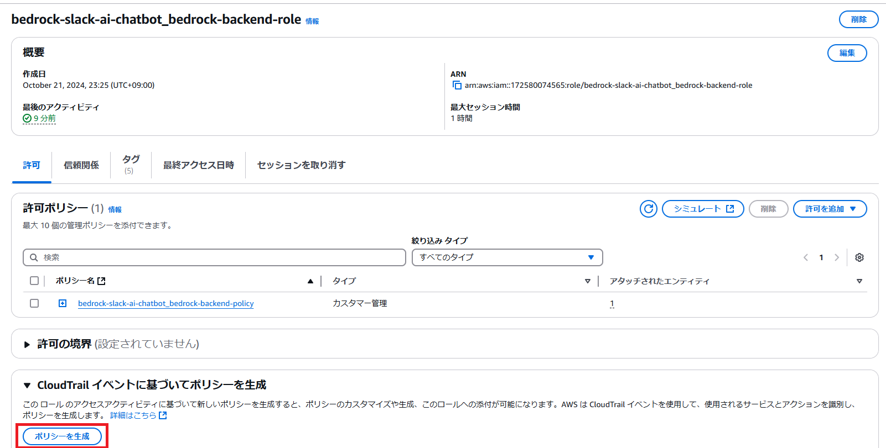
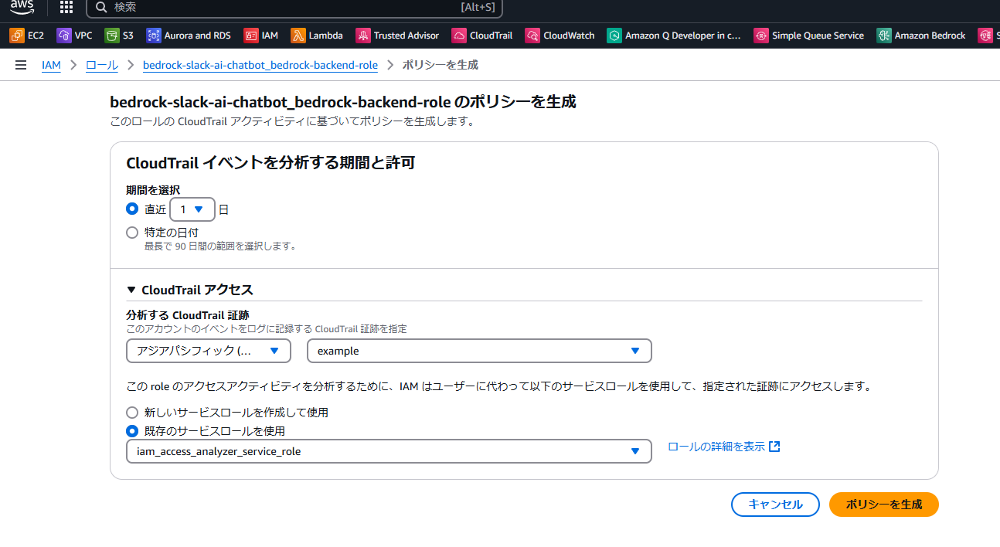
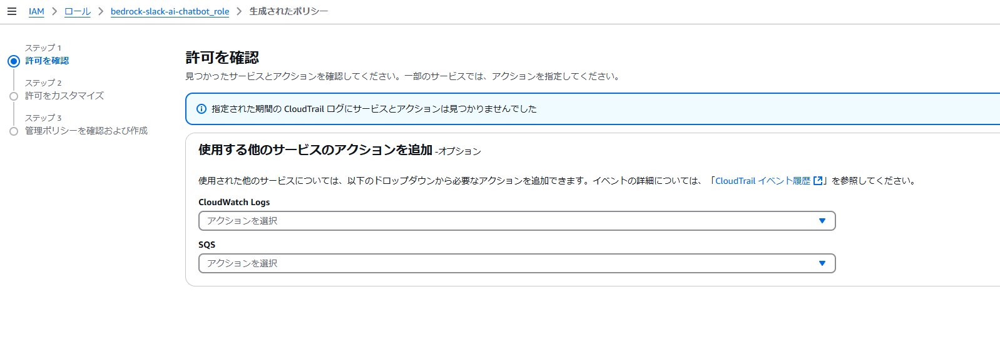

### ポリシー生成を下記リポジトリで試してます

https://github.com/haruka-aibara/iam-access-analyzer-policy-generate

### 料金

「ポリシー生成」の料金は、下記リンク先に記載されています。
https://docs.aws.amazon.com/ja_jp/IAM/latest/UserGuide/access-analyzer-policy-generation.html
> Amazon S3 の標準料金が適用されます — ポリシー生成機能を使用する場合、IAM Access Analyzer は S3 バケット内の CloudTrail ログを確認します。ポリシー生成のために CloudTrail ログにアクセスするための追加ストレージ料金はかかりません。AWS は S3 バケットに保存されている CloudTrail ログのリクエストとデータ転送に対して、Amazon S3 の標準料金を課金します。

以下の料金説明ページには、未使用のアクセスアナライザー・カスタムポリシーチェックの料金しか記載されておりません。
https://aws.amazon.com/jp/iam/access-analyzer/pricing/

### 概要

ユーザガイド
https://docs.aws.amazon.com/ja_jp/IAM/latest/UserGuide/access-analyzer-policy-generation.html

> 管理者またはデベロッパーは、IAM エンティティ (ユーザーまたはロール) に必要な権限を超えるアクセス許可を付与することがあります。IAM には、付与するアクセス許可を絞り込むのに役立つオプションがいくつか用意されています。1 つのオプションは、エンティティのアクセスアクティビティに基づく IAM ポリシーを生成することです。IAM Access Analyzer は AWS CloudTrail ログを確認し、指定した日付範囲内のロールが使用したアクセス許可を含むポリシーテンプレートを生成します。テンプレートを使用して、特定のユースケースをサポートするために必要なアクセス許可のみを付与する、きめ細かなアクセス許可を持つポリシーを作成できます。

### クォータ

https://docs.aws.amazon.com/IAM/latest/UserGuide/reference_iam-quotas.html#reference_access-analyzer-quotas

関係しそうなものは下記

 - 名前：**ポリシー世代ごとに処理される CloudTrail ログファイル**
   - デフォルト：サポートされている各リージョン: 100,000
   - 引き上げ可能：いいえ
   - 説明：ポリシー生成ごとに処理できる CloudTrail ログファイルの最大数。

 - 名前：**ポリシー生成の同時実行**
   - デフォルト：サポートされている各リージョン: 1	
   - 引き上げ可能：[いいえ]	
   - 説明：ポリシー生成の同時実行の最大数。

 - 名前：**ポリシー生成 CloudTrail のデータサイズ**
   - デフォルト：サポートされている各リージョン: 25 GB	
   - 引き上げ可能：いいえ
   - 説明：ポリシー生成ごとの CloudTrail データの最大サイズ。

 - 名前：**ポリシー生成 CloudTrail の時間範囲**
   - デフォルト：サポートされている各リージョン: 90	
   - 引き上げ可能：いいえ
   - 説明：ポリシーの生成時に選択できる CloudTrail の最大時間範囲 (日)。

 - 名前：**1 日あたりのポリシー生成数**
   - デフォルト：
     - af-south-1: 5
     - ap-east-1: 5
     - ap-southeast-3: 5
     - eu-south-1: 5
     - me-south-1: 5
     - 他のサポートされている各リージョン: 50
   - 引き上げ可能：いいえ
   - 説明：1 日あたりのポリシー生成の最大数。

### 事前に準備が必要なもの・こと

https://docs.aws.amazon.com/ja_jp/IAM/latest/UserGuide/access-analyzer-policy-generation.html#access-analyzer-policy-generation-howitworks

 - ポリシーテンプレート生成のための設定
   - **サービスロール**
     - 既存のサービスロールを指定するか、新しいサービスロールを作成する必要があります。サービスロールは、IAM Access Analyzer が CloudTrail 証跡とサービスの最終アクセス情報にアクセスして、使用されたサービスとアクションを識別できるようにします。
   - **CloudTrail 証跡**
     - ポリシーを生成する前に、アカウントのイベントをログに記録する CloudTrail 証跡を指定する必要があります。

### サービスロールに必要な権限

https://docs.aws.amazon.com/ja_jp/IAM/latest/UserGuide/access-analyzer-policy-generation.html#access-analyzer-policy-generation-perms

 - 許可ポリシー例
```
{
    "Version": "2012-10-17",
    "Statement": [
        {
            "Effect": "Allow",
            "Action": "cloudtrail:GetTrail",
            "Resource": "*"
        },
        {
            "Effect": "Allow",
            "Action": [
                "iam:GetServiceLastAccessedDetails",
                "iam:GenerateServiceLastAccessedDetails"
            ],
            "Resource": "*"
        },
        {
            "Effect": "Allow",
            "Action": [
                "s3:GetObject",
                "s3:ListBucket"
            ],
            "Resource": [
                "arn:aws:s3:::amzn-s3-demo-bucket",
                "arn:aws:s3:::amzn-s3-demo-bucket/*"
            ]
        }
    ]
}
```

 - 信頼ポリシー例
```
{
  "Version": "2012-10-17",
  "Statement": [
    {
      "Effect": "Allow",
      "Principal": {
        "Service": "access-analyzer.amazonaws.com"
      },
      "Action": "sts:AssumeRole"
    }
  ]
}
```

### 注意事項

https://docs.aws.amazon.com/ja_jp/IAM/latest/UserGuide/access-analyzer-policy-generation.html#access-analyzer-policy-generation-know

気になる点：
Control Tower で作成される専用のログアーカイブアカウントに記録される証跡ではポリシー生成できず、SCP の制限により S3 バケットのアクセス許可も再設定できないとのこと

> AWS Control Tower サポート – ポリシー生成では、ポリシー生成時に AWS Control Tower によって作成される AWS CloudTrail 証跡の使用をサポートしていません。その理由は次のとおりです。
組織の CloudTrail データは、別のアカウントである AWS Control Tower ログアーカイブアカウントにログ記録されています。
AWS Control Tower のサービスコントロールポリシー によって設定された S3 ログバケットの制限により、これらのログが保存されている S3 バケットのアクセス許可は再設定できません。

Organizations を使用した組織の証跡ではポリシー生成できます。
※ クロスアカウントアクセスなどの設定は必要です。

手順詳細は下記リンク先に記載あり

https://docs.aws.amazon.com/ja_jp/IAM/latest/UserGuide/access-analyzer-policy-generation.html#access-analyzer-policy-generation-cross-account

### ポリシーを生成する（マネジメントコンソールから）

サービスロールの名前は `AccessAnalyzerMonitorServiceRole*` で始まる必要があります。
> AWS Management Console でポリシーを生成するには、ポリシー生成に使用されるサービスロールを IAM Access Analyzer に渡すことができるアクセス許可ポリシーが IAM ユーザーに必要です。iam:PassRole には通常 iam:GetRole が付随します。これにより、ユーザーは渡されるロールの詳細を取得できます。この例でユーザーが渡すことができるのは、指定されたアカウントに存在し、AccessAnalyzerMonitorServiceRole* で始まる名前を持つロールに限ります。IAM ロールの AWS サービスへの受け渡しの詳細については、「AWS サービスにロールを渡すアクセス許可をユーザーに許可する」を参照してください。

https://docs.aws.amazon.com/ja_jp/IAM/latest/UserGuide/access-analyzer-policy-generation.html#access-analyzer-policy-generation-console

ポリシーを生成したいロールをコンソールから開きます

選択したロールにおける CloudTrail の証跡内の過去の操作をもとにポリシー生成されます。



分析する期間や、証跡にアクセスするためのサービスロールを選択し、ポリシーを生成を押下します。



数分待つと、ポリシーが生成された旨が表示されます。


使用するサービスは正確に出ているようです。



対象としたロールでは、もともと以下４つの操作のみを許可しています。
これは、生成されたポリシーにおけるサービス（CloudWatch Logs / SQS）と合致しています。
 - logs:CreateLogGroup
 - logs:CreateLogStream
 - logs:PutLogEvents
 - sqs:SendMessage

実際にポリシー生成してみたロールの Terraform 定義
```
data "aws_iam_policy_document" "slack_ai_chatbot" {
  statement {
    sid       = "loggroup"
    effect    = "Allow"
    actions   = ["logs:CreateLogGroup"]
    resources = ["arn:aws:logs:${data.aws_region.current.name}:${data.aws_caller_identity.current.account_id}:*"]
  }

  statement {
    sid    = "logevents"
    effect = "Allow"
    actions = [
      "logs:CreateLogStream",
      "logs:PutLogEvents"
    ]
    resources = [
      "arn:aws:logs:${data.aws_region.current.name}:${data.aws_caller_identity.current.account_id}:log-group:/aws/lambda/${aws_lambda_function.slack_ai_chatbot.function_name}:*"
    ]
  }

  statement {
    sid     = "sqs"
    effect  = "Allow"
    actions = ["sqs:SendMessage"]
    resources = [
      aws_sqs_queue.slack_ai_chatbot.arn
    ]
  }
}
```

### ポリシー生成する AWS サービス・アクション一覧

以下にリストされています

https://docs.aws.amazon.com/ja_jp/IAM/latest/UserGuide/access-analyzer-policy-generation-action-last-accessed-support.html
