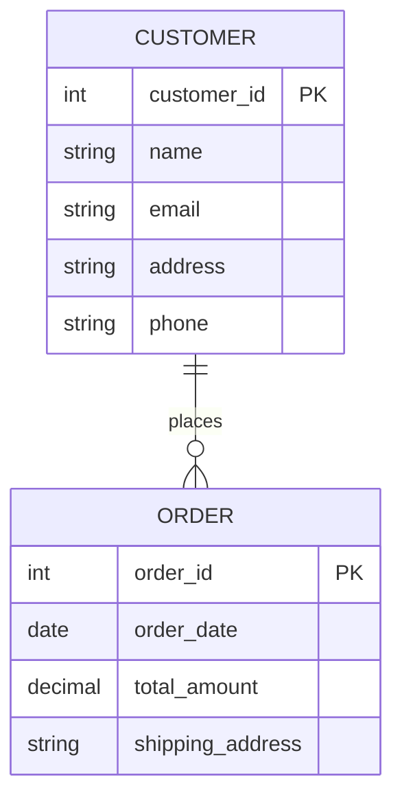
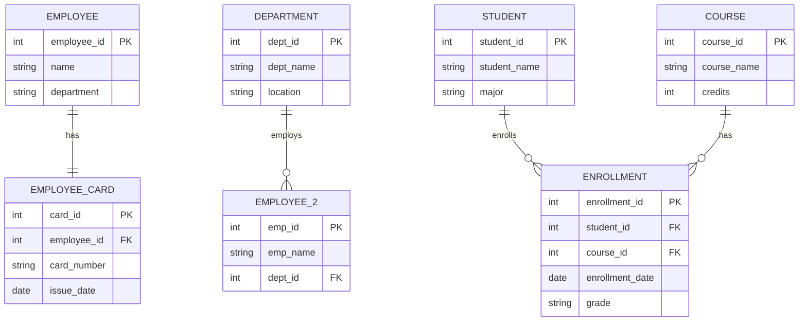
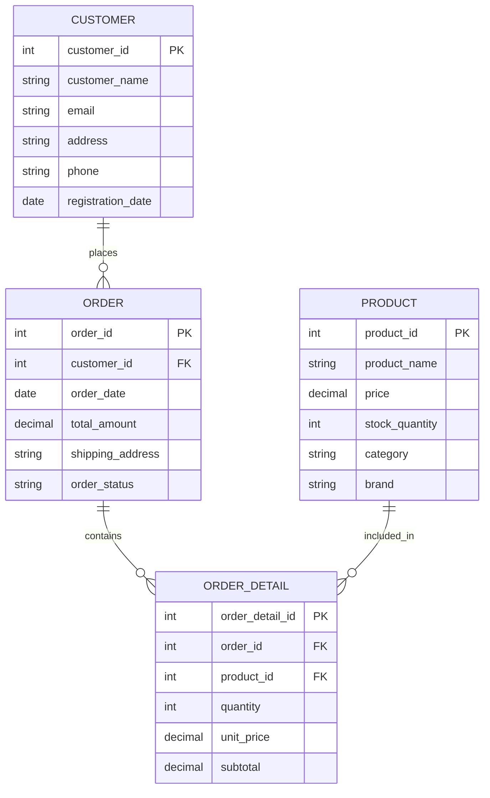
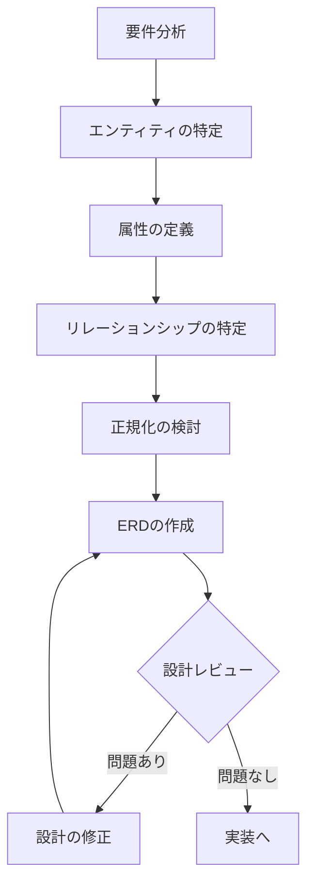
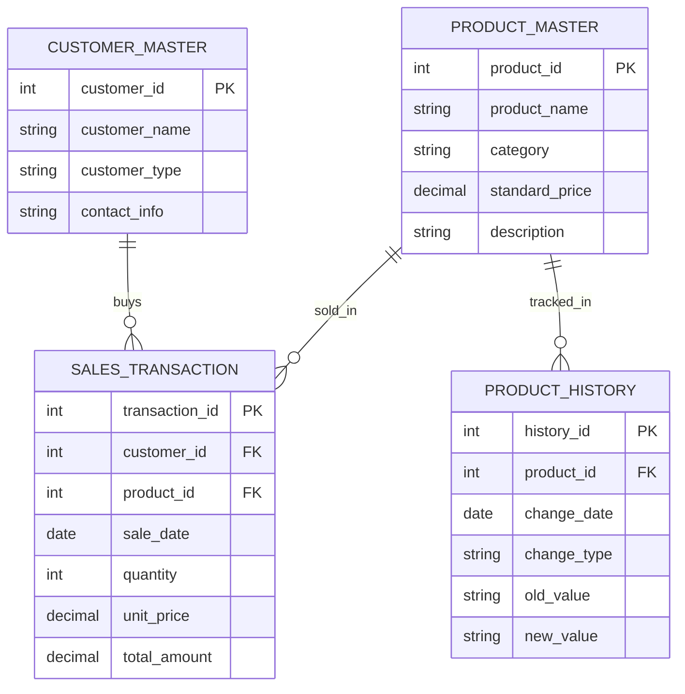

# ERD（Entity Relationship Diagram） (難易度レベル: 100)

## 概要
ERD（Entity Relationship Diagram）は、データベース設計において、データの構造と関係性を視覚的に表現する図表です。エンティティ（実体）、属性、リレーションシップ（関係）の3つの要素で構成され、データベースの設計図として機能します。システム開発の初期段階で、データの全体像を把握し、関係者間での認識を統一するために重要な役割を果たします。

## 詳細

### ERDとは何か
ERDは「Entity Relationship Diagram」の略で、日本語では「実体関連図」と呼ばれます。データベースに格納する情報を整理し、どのようなデータが存在し、それらがどのように関連しているかを図で表現します。

### ERDの3つの基本要素

#### 1. エンティティ（Entity）
- **定義**: データベースに格納する対象となる「もの」や「概念」
- **例**: 顧客、商品、注文、従業員、部門
- **特徴**: 独立して存在でき、他のエンティティと区別できる
- **表現方法**: 四角形や長方形で表される

#### 2. 属性（Attribute）
- **定義**: エンティティの特徴や性質を表す情報
- **例**: 顧客の名前、住所、電話番号
- **種類**: 
  - 基本属性：エンティティの基本的な情報
  - 識別属性：エンティティを一意に識別する情報（主キー）
  - 複合属性：複数の要素から構成される情報
- **表現方法**: 楕円形や円で表される

#### 3. リレーションシップ（Relationship）
- **定義**: エンティティ間の関連性や結びつき
- **例**: 顧客が注文する、従業員が部門に所属する
- **特徴**: 2つ以上のエンティティを結びつける
- **表現方法**: ひし形や線で表される

### ERDの基本要素の図解

### リレーションシップの種類

#### 1. 1対1（1:1）
- **説明**: 一方のエンティティの1つのインスタンスが、他方のエンティティの1つのインスタンスと関連
- **例**: 従業員と従業員カード（1人の従業員に1枚のカード）
- **特徴**: 比較的少ない関係性

#### 2. 1対多（1:N）
- **説明**: 一方のエンティティの1つのインスタンスが、他方のエンティティの複数のインスタンスと関連
- **例**: 部門と従業員（1つの部門に複数の従業員が所属）
- **特徴**: 最も一般的な関係性

#### 3. 多対多（M:N）
- **説明**: 一方のエンティティの複数のインスタンスが、他方のエンティティの複数のインスタンスと関連
- **例**: 学生と授業（1人の学生が複数の授業を取る、1つの授業に複数の学生が参加）
- **特徴**: 中間テーブルが必要になることが多い

### リレーションシップの種類の図解

## 具体例

### オンラインショップのERD例

#### エンティティの例
1. **顧客（Customer）**
   - 属性：顧客ID、名前、メールアドレス、住所、電話番号

2. **商品（Product）**
   - 属性：商品ID、商品名、価格、在庫数、カテゴリ

3. **注文（Order）**
   - 属性：注文ID、注文日、合計金額、配送先

4. **注文詳細（OrderDetail）**
   - 属性：注文詳細ID、数量、単価

#### リレーションシップの例
- 顧客 → 注文（1対多）：1人の顧客が複数の注文を出す
- 注文 → 注文詳細（1対多）：1つの注文に複数の商品が含まれる
- 商品 → 注文詳細（1対多）：1つの商品が複数の注文に含まれる

### オンラインショップのERD図

### 基本的な設計手順

#### ステップ1: エンティティの特定
- システムで管理したい「もの」を洗い出す
- 例：「顧客」「商品」「注文」「配送」など

#### ステップ2: 属性の定義
- 各エンティティに必要な情報を整理
- 識別子（主キー）を決定
- データ型や制約を検討

#### ステップ3: リレーションシップの特定
- エンティティ間の関連性を整理
- 関係の種類（1:1、1:N、M:N）を決定
- 外部キーの配置を検討

#### ステップ4: 正規化の検討
- データの重複を排除
- 整合性を保つための設計を検討

### 設計プロセスのフロー図

## 実践的な活用方法

### 設計時の注意点

#### 1. 命名規則の統一
- エンティティ名：単数形、名詞
- 属性名：分かりやすい名前
- リレーションシップ名：動詞や動詞句

#### 2. 主キーの設計
- 一意性の確保
- 変更されない値の選択
- パフォーマンスを考慮した設計

#### 3. 外部キーの配置
- 参照整合性の確保
- 適切なテーブルへの配置
- 削除・更新時の動作の定義

### よくある設計パターン

#### 1. マスターデータの管理
- 商品マスター、顧客マスターなど
- 基本的な情報を一元管理
- 他のテーブルから参照される

#### 2. トランザクションデータの管理
- 注文、売上などの取引データ
- 時系列での履歴管理
- 大量のデータが蓄積される

#### 3. 中間テーブルの活用
- 多対多の関係を解決
- 追加の属性を格納
- 履歴管理の実現

### 設計パターンの図解

## まとめ

ERDは、データベース設計の基礎となる重要なツールです。適切に作成されたERDにより、以下のメリットが得られます：

- **設計の明確化**: データ構造が視覚的に理解できる
- **コミュニケーション**: 関係者間での認識統一
- **品質向上**: 設計段階での問題発見
- **保守性**: システム変更時の影響範囲の把握

### 学んだことの振り返り
- ERDの基本概念と3つの要素
- リレーションシップの種類と特徴
- 実践的な設計手順
- 設計時の注意点とベストプラクティス

### 次のステップへの提案
1. **正規化**の概念について学習
2. **データベース設計ツール**の使用方法
3. **実際のプロジェクト**でのERD作成実践
4. **高度なERD記法**（Crow's Foot記法など）の理解
5. **データベース実装**への変換手法 
