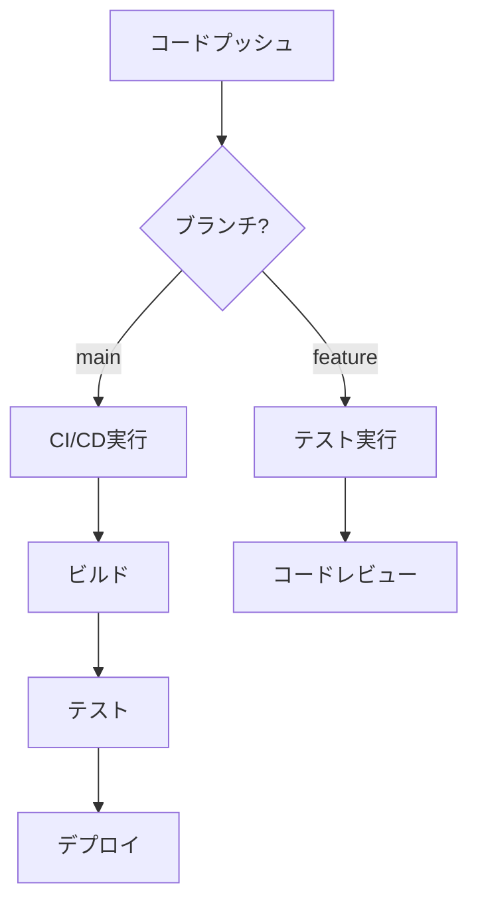

# GitHub Actionsのユースケース

GitHub Actionsは、ソフトウェア開発のワークフローを自動化するための強力なツールです。CI/CD、テスト自動化、デプロイメントなど、様々な開発プロセスを効率化することができます。

## 主要なユースケース

1. **継続的インテグレーション（CI）**
   - コードの自動ビルド
   - 自動テスト実行
   - コード品質チェック

2. **継続的デリバリー（CD）**
   - 自動デプロイメント
   - 環境への自動リリース
   - バージョン管理

3. **コード品質管理**
   - 静的解析
   - セキュリティスキャン
   - コードスタイルチェック

4. **ドキュメント管理**
   - 自動ドキュメント生成
   - ドキュメントの自動デプロイ
   - 変更履歴の追跡

## 実装例

```yaml
name: CI/CD Pipeline

on:
  push:
    branches: [ main ]
  pull_request:
    branches: [ main ]

jobs:
  build-and-test:
    runs-on: ubuntu-latest
    steps:
      - uses: actions/checkout@v3
      - name: Setup Node.js
        uses: actions/setup-node@v3
        with:
          node-version: '18'
      - name: Install dependencies
        run: npm install
      - name: Run tests
        run: npm test
```

## ワークフロー図



## セキュリティ考慮事項

- シークレットの適切な管理
- 最小権限の原則に基づく権限設定
- 依存関係の定期的な更新
- セキュリティスキャンの自動化

## 参考資料

- [GitHub Actions公式ドキュメント](https://docs.github.com/ja/actions)
- [GitHub Actionsのベストプラクティス](https://docs.github.com/ja/actions/learn-github-actions/security-hardening-for-github-actions)
