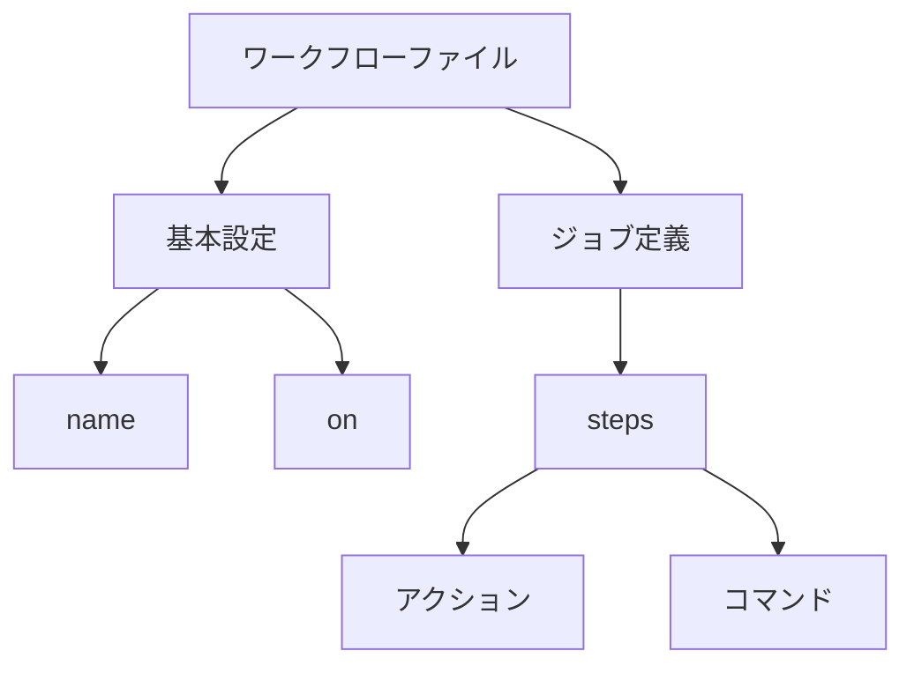

# GitHub ActionsのYAMLシンタックス

GitHub ActionsのワークフローはYAMLファイルで定義され、シンプルで読みやすい形式で自動化プロセスを記述できます。

## YAMLの基本構造

YAMLは、キーと値のペア、リスト、ネストされた構造を表現できるデータ形式です。GitHub Actionsでは、主に以下の要素を使用します：

1. **キーと値**
   ```yaml
   name: ワークフロー名
   on: push
   ```

2. **リスト**
   ```yaml
   branches:
     - main
     - develop
   ```

3. **ネストされた構造**
   ```yaml
   jobs:
     build:
       runs-on: ubuntu-latest
       steps:
         - name: ステップ名
           run: コマンド
   ```

## 主要なYAML要素

### 1. ワークフローの基本構造
```yaml
name: ワークフロー名
on: トリガー
jobs:
  ジョブ名:
    runs-on: 実行環境
    steps:
      - name: ステップ名
        uses: アクション
```

### 2. 条件分岐
```yaml
if: ${{ github.ref == 'refs/heads/main' }}
```

### 3. 環境変数
```yaml
env:
  NODE_ENV: production
```

## シンタックス図



## 注意点

1. **インデント**
   - スペースを使用（タブは使用不可）
   - 一貫したインデントレベルを維持

2. **文字列**
   - 特殊文字を含む場合は引用符を使用
   - 複数行の文字列は `|` または `>` を使用

3. **コメント**
   - `#` で始まる行はコメントとして扱われる

## ベストプラクティス

- 適切なインデントを使用
- 意味のある名前を付ける
- コメントを活用して可読性を向上
- 再利用可能なワークフローを作成

## 参考資料

- [YAML公式仕様](https://yaml.org/spec/1.2/spec.html)
- [GitHub Actionsのワークフロー構文](https://docs.github.com/ja/actions/using-workflows/workflow-syntax-for-github-actions)
