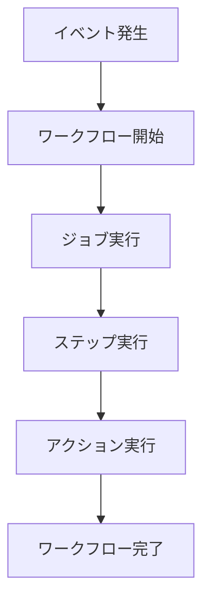

# GitHub Actionsとは

GitHub Actionsは、ソフトウェア開発のワークフローを自動化するための強力なCI/CD（継続的インテグレーション/継続的デリバリー）プラットフォームです。コードのビルド、テスト、デプロイなどの作業を自動化し、開発効率を大幅に向上させることができます。

## 主要概念

GitHub Actionsは、ワークフロー（Workflow）、ジョブ（Job）、ステップ（Step）という3つの主要な概念で構成されています。ワークフローはYAMLファイルで定義され、リポジトリの`.github/workflows`ディレクトリに配置されます。各ワークフローは特定のイベント（プッシュ、プルリクエストなど）をトリガーとして実行されます。

## 実装例

以下は、Node.jsアプリケーションのビルドとテストを自動化する基本的なワークフローの例です：

```yaml
name: Node.js CI

on:
  push:
    branches: [ main ]
  pull_request:
    branches: [ main ]

jobs:
  build:
    runs-on: ubuntu-latest

    steps:
    - uses: actions/checkout@v3
    - name: Use Node.js
      uses: actions/setup-node@v3
      with:
        node-version: '18.x'
    - run: npm ci
    - run: npm test
```

## ワークフローの基本構造



## セキュリティに関する考慮事項

- シークレット（機密情報）は必ずGitHubのシークレット機能を使用して管理
- 最小権限の原則に従い、必要な権限のみを付与
- サードパーティのアクションを使用する際は、信頼できるソースからのものを選択

## 参考資料

- [GitHub Actions公式ドキュメント](https://docs.github.com/ja/actions)
- [GitHub Actionsのワークフロー構文](https://docs.github.com/ja/actions/using-workflows/workflow-syntax-for-github-actions)
