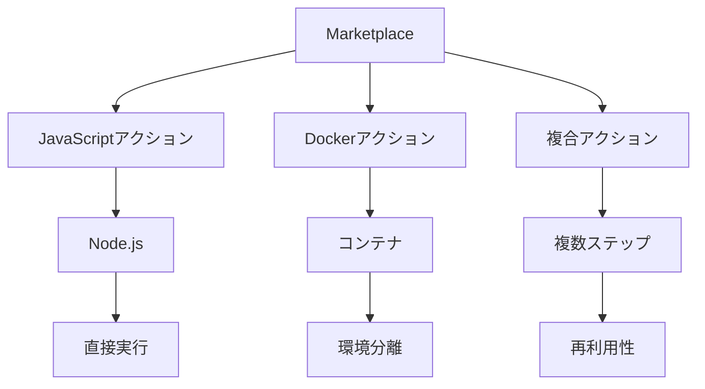

# GitHub Actions Marketplace Actions

GitHub Actions Marketplaceは、ワークフロー自動化のための豊富なアクションを提供するエコシステムであり、開発プロセスの効率化に役立ちます。

Marketplace Actionsとは、GitHub Actionsのエコシステム内で共有・再利用可能な実行単位であり、特定のタスクを自動化するためのコードパッケージです。



## Marketplace Actionsの基本

### Actionsとは
Actionsは、GitHub上で特定のタスクを自動化するための再利用可能なコードユニットです。これらはワークフローの中で使用され、テスト実行、デプロイ、通知送信などの一般的な開発タスクを簡素化します。

### Marketplaceの役割
GitHub Actions Marketplaceは、コミュニティによって作成された何千もの検証済みアクションを集めた場所です。公式のアクションとコミュニティ作成のアクションの両方が含まれています。

## Actionsの種類

### JavaScriptアクション
Node.jsで記述され、GitHubランナー上で直接実行されるアクションです。

### Dockerアクション
Dockerコンテナ内で実行されるアクション。環境を完全に制御できるため、特定の依存関係が必要な場合に便利です。

### 複合アクション
複数のステップを1つのアクションにまとめたもので、ワークフロー内で再利用可能なステップのシーケンスを作成できます。

## Marketplaceからのアクションの使用方法

### アクションの検索
1. GitHubリポジトリで「Actions」タブを選択
2. 新しいワークフローを作成または既存のワークフローを編集
3. 「Marketplace」を検索して必要なアクションを見つける

### アクションの参照方法
アクションは `{所有者}/{リポジトリ}@{ref}` の形式で参照します：
```yaml
- uses: actions/checkout@v3
```

### バージョン指定の方法
アクションを参照する際には、以下のいずれかの方法でバージョンを指定できます：
- メジャーバージョン: `@v3`（互換性のある最新のマイナーバージョンを自動的に使用）
- 特定のバージョン: `@v3.1.0`（特定のバージョンを固定）
- コミットSHA: `@a1b2c3d`（特定のコミットを固定）

## よく使われるMarketplaceアクション

### actions/checkout
リポジトリのコードをチェックアウトするための基本アクション。ほとんどのワークフローで最初に使用されます。
```yaml
- uses: actions/checkout@v3
```

### actions/setup-node
Node.jsをセットアップするアクション。npmパッケージの使用や、JavaScriptプロジェクトのビルドに必要です。
```yaml
- uses: actions/setup-node@v3
  with:
    node-version: '16'
```

### actions/cache
依存関係をキャッシュしてワークフローの実行を高速化するアクション。
```yaml
- uses: actions/cache@v3
  with:
    path: ~/.npm
    key: ${{ runner.os }}-node-${{ hashFiles('**/package-lock.json') }}
```

## 独自のアクションの公開方法

### アクションの作成
1. 新しいリポジトリを作成（命名規則: `{アクション名}-action`）
2. `action.yml` ファイルを作成して、アクションのメタデータを定義
3. アクションのコードを実装（JavaScript、Dockerfileなど）

### action.ymlの例
```yaml
name: '私のカスタムアクション'
description: 'これは私のカスタムアクションの説明です'
inputs:
  my-input:
    description: '入力パラメータの説明'
    required: true
    default: 'デフォルト値'
outputs:
  my-output:
    description: '出力パラメータの説明'
runs:
  using: 'node16'
  main: 'index.js'
```

### Marketplaceでの公開
1. アクションをGitHubにプッシュ
2. リリースをタグ付け（例: v1.0.0）
3. リポジトリページからMarketplaceへの公開を選択

## セキュリティのベストプラクティス

### 信頼できるアクションの使用
- 公式またはよく知られた組織のアクションを優先
- スターやフォーク数、更新頻度を確認
- コードをレビューして悪意のあるコードがないか確認

### バージョン固定
コミットSHAを使用してアクションのバージョンを固定することで、予期しない変更や悪意のある更新からワークフローを保護します。
```yaml
- uses: actions/checkout@a1b2c3d4e5f6g7h8i9j0k1l2m3n4o5p6q7r8s9
```

### シークレットの適切な管理
- 機密情報はGitHub Secretsを使用して保護
- 必要最小限の権限を持つトークンを使用

## トラブルシューティング

### 一般的な問題
- アクションのバージョンの互換性
- 入力パラメータの形式や値の誤り
- 環境変数の設定ミス

### デバッグテクニック
1. ワークフロー実行ログの確認
2. `ACTIONS_STEP_DEBUG` シークレットを `true` に設定して詳細なログを有効化
3. 問題のあるアクションのイシュートラッカーを確認

## まとめ

GitHub Actions Marketplaceは開発ワークフローを自動化するための強力なリソースです。公式およびコミュニティのアクションを活用することで、一般的なタスクを効率化し、開発プロセスを改善できます。アクションを選択する際はセキュリティを考慮し、バージョンを固定することをお忘れなく。
