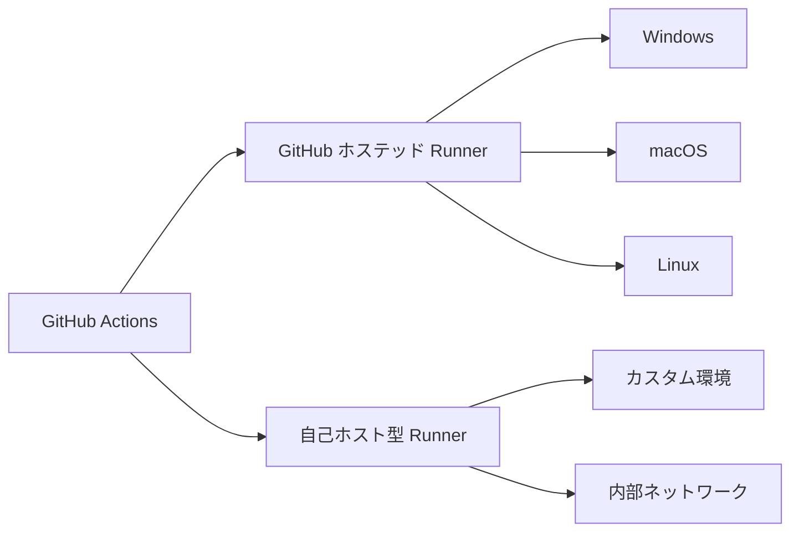

# GitHub Actions Runner

GitHub Actions Runner は、GitHub Actions のワークフローを実行するためのサーバー環境です。このコンポーネントはCI/CDパイプラインの実行基盤として重要な役割を果たします。

Runner とは、ワークフローのジョブを実行するコンピューティング環境で、GitHub がホストするランナーと自己ホスト型ランナーの2種類があります。



## GitHub ホステッド Runner

- **概要**: GitHub が提供する仮想マシン環境
- **対応OS**: Windows, macOS, Linux (Ubuntu)
- **スペック**: 2-core CPU, 7GB RAM, 14GB SSD
- **使用時間**: 無料アカウントでは月間2,000分、それ以上は有料

## 自己ホスト型 Runner

- **概要**: 自分で管理するサーバーやVM上で動作するRunner
- **メリット**: カスタマイズ可能、内部ネットワークへのアクセス、高スペックマシンの利用
- **対応プラットフォーム**: Windows, macOS, Linux, ARM, コンテナ

## Runner の設定方法

### GitHub ホステッド Runner の指定

```yaml
jobs:
  build:
    runs-on: ubuntu-latest  # GitHub提供のUbuntuランナーを使用
```

### 自己ホスト型 Runner の設定

1. **インストール**: リポジトリ設定からRunnerをダウンロード・インストール
2. **ラベル付け**: カスタムラベルを付けて特定のRunnerを指定可能
3. **ワークフローでの指定**:

```yaml
jobs:
  build:
    runs-on: self-hosted  # 自己ホスト型ランナーを使用
```

## Runner グループ

- **概要**: Runnerをグループ化して管理する機能
- **利点**: アクセス制御、組織的な管理が可能
- **設定場所**: Organization設定 > Actions > Runner groups

## Runner の使い分け

- **GitHub ホステッド**: 
  - 単純なビルド/テスト
  - オープンソースプロジェクト
  - 特別な環境要件がない場合

- **自己ホスト型**:
  - 特殊なハードウェア要件
  - セキュリティ要件が厳しい環境
  - 内部ネットワークへのアクセスが必要
  - コスト削減（大規模プロジェクト）

## セキュリティ上の注意点

- 自己ホスト型Runnerは公開リポジトリでは注意が必要（悪意のあるコードを実行される可能性）
- 権限は最小限に設定する
- シークレットの適切な管理
- Runner環境のアップデートを定期的に実施

## トラブルシューティング

- Runner接続エラー: ネットワーク設定を確認
- 容量不足: ディスク容量の確保
- パフォーマンス問題: スペックアップまたは並列実行数の調整
