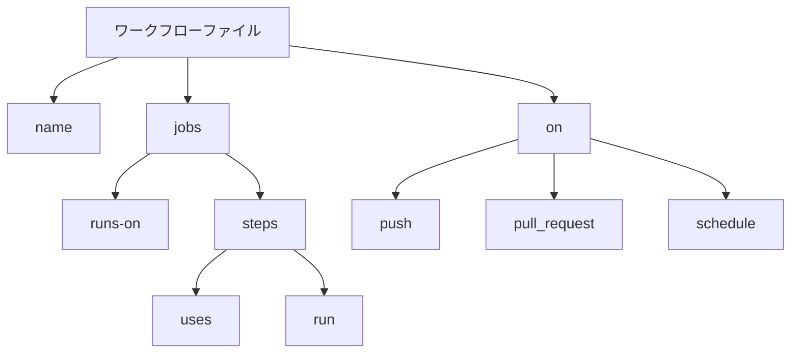

# GitHub Actions - ワークフロー構成の基本

GitHub Actionsは、ソフトウェア開発のワークフローを自動化するためのCI/CDプラットフォームです。

ワークフローは、YAMLファイルで定義され、リポジトリの`.github/workflows`ディレクトリに配置されます。



## ワークフロー構成ファイルの基本要素

GitHubワークフローは、`.github/workflows`ディレクトリにYAMLファイルとして定義されます。以下は主要な構成要素です。

### name（ワークフロー名）

```yaml
name: First Workflow
```

`name`はワークフローの名前を定義します。これはGitHubのActionsタブに表示され、複数のワークフローを区別するのに役立ちます。省略可能ですが、設定することを推奨します。

### on（トリガー）

```yaml
on: workflow_dispatch
```

`on`はワークフローが実行されるタイミング（トリガー）を指定します。例：

- `workflow_dispatch`: 手動で実行
- `push`: プッシュ時に実行
- `pull_request`: プルリクエスト時に実行
- `schedule`: 定期的に実行

### jobs（ジョブ）

```yaml
jobs:
  first-job:
    runs-on: ubuntu-latest
    steps:
      - name: Print greeting
        run: echo "hello world"
      - name: Print goodbye
        run: echo "Done - bye!"
```

`jobs`はワークフローが実行するジョブを定義します。
- `first-job`はジョブIDです（任意の名前を付けられます）
- 各ジョブは独立した環境で実行されます

### runs-on（実行環境）

```yaml
runs-on: ubuntu-latest
```

`runs-on`はジョブが実行される環境（ランナー）を指定します。
- `ubuntu-latest`: 最新のUbuntu
- `windows-latest`: 最新のWindows
- `macos-latest`: 最新のmacOS

### steps（ステップ）

```yaml
steps:
  - name: Print greeting
    run: echo "hello world"
  - name: Print goodbye
    run: echo "Done - bye!"
```

`steps`はジョブ内で実行される個々のタスクを定義します。
- `name`: ステップの名前（GitHub上で表示される）
- `run`: 実行するコマンド

各ステップは順番に実行され、前のステップが成功した場合にのみ次のステップに進みます。

## 完全なサンプル

```yaml
name: First Workflow
on: workflow_dispatch
jobs:
  first-job:
    runs-on: ubuntu-latest
    steps:
      - name: Print greeting
        run: echo "hello world"
      - name: Print goodbye
        run: echo "Done - bye!"
```

このサンプルは、手動で起動できる「First Workflow」という名前のワークフローを作成し、Ubuntu環境で「hello world」を表示した後、「Done - bye!」と出力して終了します。
