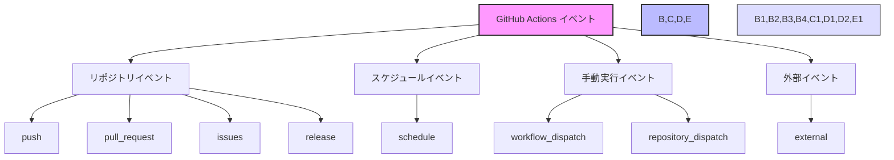

# GitHub Actionsのイベント



> 詳細は[公式ドキュメント: Events that trigger workflows](https://docs.github.com/en/actions/using-workflows/events-that-trigger-workflows)を参照してください。

GitHub Actionsでは、ワークフローを実行するきっかけとなる様々なイベントを設定することができます。これらのイベントを理解することで、自動化のタイミングを適切に制御できます。

## 主なイベントの種類

### 1. リポジトリイベント
- `push`: コードがプッシュされたとき
- `pull_request`: プルリクエストが作成、更新、マージされたとき
- `issues`: イシューが作成、更新、クローズされたとき
- `release`: リリースが作成、更新、削除されたとき

### 2. スケジュールイベント
- `schedule`: cron形式で指定した時間に実行
  ```yaml
  schedule:
    - cron: '0 0 * * *'  # 毎日0時に実行
  ```

### 3. 手動実行イベント
- `workflow_dispatch`: GitHubのUIから手動で実行
- `repository_dispatch`: APIから外部から実行をトリガー

### 4. 外部イベント
- `external`: 外部サービスからのWebhookを受け取ったとき

## イベントの設定方法

ワークフローファイル（.github/workflows/）で以下のように設定します：

```yaml
name: イベントの例
on:
  push:
    branches: [ main ]  # mainブランチへのプッシュ時のみ実行
  pull_request:
    types: [opened, synchronize]  # プルリクエストの作成と更新時のみ実行
```

## 重要なポイント

1. 複数のイベントを組み合わせることができます
2. イベントごとに実行条件を細かく設定可能です
3. 不要なイベントを設定すると、意図しないタイミングでワークフローが実行される可能性があります

## 使用例

```yaml
name: テスト実行
on:
  push:
    branches: [ main, develop ]
    paths:
      - 'src/**'  # srcディレクトリ内のファイルが変更された場合のみ実行
  pull_request:
    branches: [ main ]
```

このように、イベントを適切に設定することで、必要なタイミングでのみワークフローを実行することができます。
